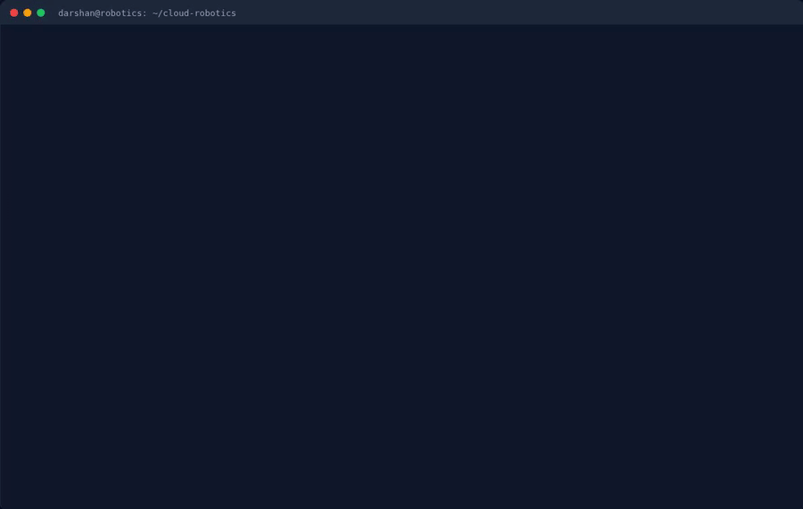
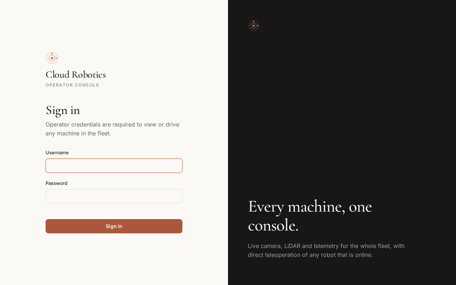
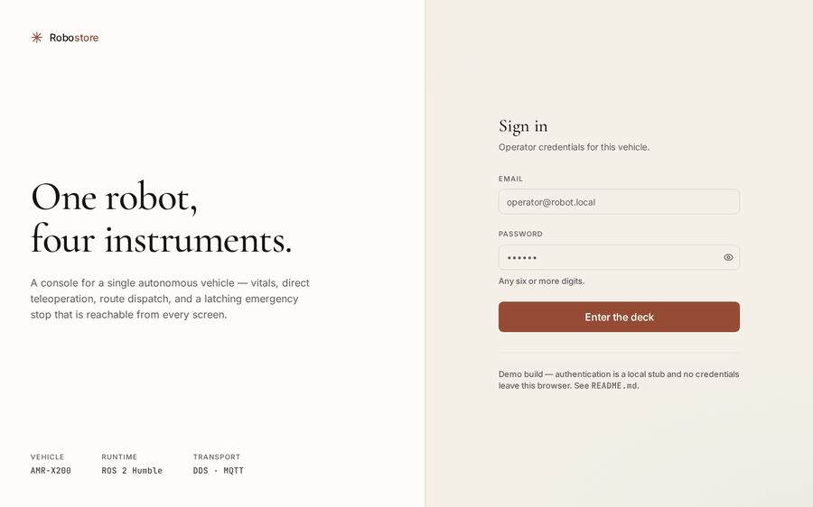
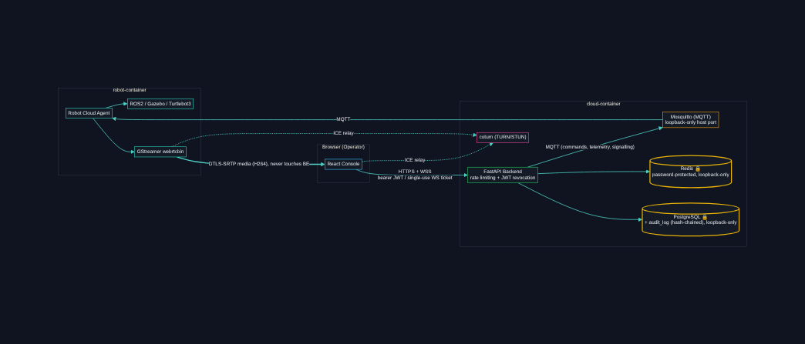
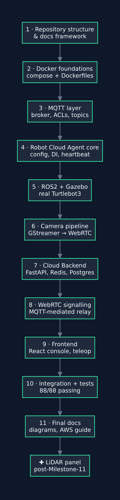

# Cloud Robotics Platform

A local, Docker-based simulation of a **production cloud robotics platform** — a browser-based fleet operator console that tele-operates a ROS2 robot (Turtlebot3 in Gazebo) over MQTT, with live video over WebRTC and a live LiDAR scan panel alongside it.

It is built to run entirely on one machine today and move to AWS later **without an architectural rewrite** — only endpoints change (`localhost` → real AWS service addresses). See [`docs/00-overview.md`](docs/00-overview.md) for why the system is shaped the way it is, and [`docs/11-aws-migration.md`](docs/11-aws-migration.md) for the concrete migration path.

## See it running

Real captures of the actual stack - a terminal bringing it up, the browser console driving a real robot, a three-robot fleet, and the ROBOSTORE demo console. Not mockups; see [`docs/images/README.md`](docs/images/README.md) for exactly how these were made, and [`EXECUTION.md`](EXECUTION.md) for step-by-step run instructions for both applications.

<table>
<tr>
<td width="50%">

**`docker compose up` → a live robot**



</td>
<td width="50%">

**Login → live video + LiDAR → drive it**


</td>
</tr>
<tr>
<td width="50%">

**A fleet, not one robot** — `make up-fleet`



</td>
<td width="50%">

**ROBOSTORE** — the demo app-store console



</td>
</tr>
</table>

Both applications, with credentials and every run command: [`EXECUTION.md`](EXECUTION.md).

## New here? Start with the docs

This repository is being built **milestone by milestone**, and every milestone gets a companion doc in [`docs/`](docs/) written to teach the concept, not just describe the code. Read them in order — they're numbered for that reason. Start at [`docs/README.md`](docs/README.md).

Looking something up rather than reading start to finish:

| Doc | For |
|---|---|
| [`api-reference.md`](docs/api-reference.md) | Every REST endpoint, WebSocket message, and MQTT topic |
| [`configuration-reference.md`](docs/configuration-reference.md) | Every `.env`/config parameter and the ROS2 ⇄ MQTT ⇄ REST mapping |
| [`12-security-hardening.md`](docs/12-security-hardening.md) | The first security pass: what was wrong and what was fixed |
| [`security-findings.md`](docs/security-findings.md) | The second, deeper audit — 11 findings, each with evidence, fix, and verification |
| [`architecture-assessment.md`](docs/architecture-assessment.md) | Honest scoring for scale, security, modularity, integrity — rated separately for one institution vs. many |
| [`target-architecture.md`](docs/target-architecture.md) | The design for multi-institution deployment: 7 principles, 11 decisions, staged migration |
| [`execution-strategy.md`](docs/execution-strategy.md) | How to actually build toward that: parallel tracks, quality gates, failure modes |

## Architecture at a glance



**Command path** (browser → robot):

```
Browser → React → FastAPI → MQTT → Robot Cloud Agent → ROS2 → Turtlebot3
```

**Video path** (robot → browser):

```
Camera → ROS2 → GStreamer → WebRTC → Browser
```

Two containers, two clear responsibilities:

| Container | Responsibility |
|---|---|
| `robot-container/` | Everything that must live next to the robot: ROS2, the simulated Turtlebot3, and the Robot Cloud Agent that bridges ROS2 to the cloud. Never exposed directly to the browser. |
| `cloud-container/` | Everything the fleet operator touches: the FastAPI backend, the MQTT broker, Redis, PostgreSQL, and the React frontend. **Never talks to ROS2 directly** — only MQTT. |

## Repository layout

```
cloud-robotics/
├── docs/              # Numbered learning docs — read these first
├── robot-container/   # ROS2 + Turtlebot3 + Robot Cloud Agent
├── cloud-container/   # FastAPI + MQTT broker + Redis + Postgres + React
└── robostore-poc/     # Standalone demo app-store console — see below
```

See [`docs/01-repository-structure.md`](docs/01-repository-structure.md) for a full walkthrough of every folder and why it exists. (A visual version of this same tree: [`docs/images/repo-layout.png`](docs/images/repo-layout.png).)

## Build roadmap




This is being implemented one milestone at a time. Each milestone is reviewed and runnable before the next begins.

- [x] 1. Repository structure & docs framework
- [x] 2. Docker setup (compose file, Dockerfiles, minimal bootable services)
- [x] 3. MQTT layer (broker config, topic contracts, pub/sub tests)
- [x] 4. Robot Cloud Agent core (config, logging, DI, MQTT client, heartbeat, health, watchdog)
- [x] 5. ROS2 + Turtlebot3 + Gazebo integration (real `ROSAdapter`)
- [x] 6. Camera pipeline: GStreamer H264 → WebRTC (real video, verified live in a real browser — see below)
- [x] 7. Cloud Backend (FastAPI modules, Redis + PostgreSQL — verified against a real robot, see below)
- [x] 8. WebRTC signalling (real, MQTT-mediated — replaced the throwaway dev HTTP server, verified with a real browser, see below)
- [x] 9. Frontend (React + TypeScript + Tailwind, keyboard teleop — verified against a real, unmodified Chrome browser, see below)
- [x] 10. Full end-to-end integration + test suite (one command — see below)
- [x] 11. Final documentation pass (diagrams, API/MQTT reference, deployment & AWS migration guides — see below)

Post-milestone work, same standard — built, verified live, documented:

- [x] **LiDAR** — the Turtlebot3's `/scan` end to end, agent → MQTT → backend → a canvas panel beside the camera feed
- [x] **Security hardening** — Redis auth, JWT revocation, single-use WebSocket tickets, login lockout, a tamper-evident audit chain, non-root containers ([`docs/12-security-hardening.md`](docs/12-security-hardening.md))
- [x] **Second security audit** — 11 further findings across the robot container, WebRTC path, broker limits, and dev workflow, all fixed and regression-tested ([`docs/security-findings.md`](docs/security-findings.md))
- [x] **MQTT TLS + mutual TLS** — per-device certificates where the cert CN becomes the MQTT identity
- [x] **Multi-institution design** — assessment, target architecture, and execution strategy ([`docs/target-architecture.md`](docs/target-architecture.md))

## ROBOSTORE (demo app-store console, POC)

[`robostore-poc/`](robostore-poc/) is a second, independent frontend for
showcasing new operator-app ideas — a separate login and "mission deck" hub
leading to four working apps (Dashboard, Emergency Stop, Remote Controller,
Simple Route Planner), each proposed and built one at a time, all real now.
It's a deliberately separate React app (different framework versions,
different design system) so nothing in it can destabilize the real console
above — see [`robostore-poc/README.md`](robostore-poc/README.md) for the
full rationale, its two-data-layer split (why every app currently renders
with no live data, and how that gets wired up for real later), and the
decisions made where its build brief was ambiguous.

**Login:** `operator@robot.local` / `123456` (any email + a 6-digit-or-longer
password also works — this is a stub gate, not real auth, see
`robostore-poc/README.md`).

Full step-by-step run instructions are their own section, separate from the
main system's below: [Running ROBOSTORE](#running-robostore).

## Running it

There's a `Makefile` wrapping every command below — run `make` (or `make help`) at any time to see the full list. Every target is just a named shortcut for the raw `docker compose`/`pytest` command shown next to it, so use whichever you prefer.

### Prerequisites

- Docker + Docker Compose v2 (`docker compose version`)
- ~6GB free RAM for the full stack (Gazebo is the heavy one — see the resource limits on the `robot` service in `docker-compose.yml` if you're on a tighter machine)
- A real Chrome/Chromium browser to drive the console (the video path specifically needs a real browser's WebRTC stack — see [`docs/09-frontend.md`](docs/09-frontend.md))
- Nothing else — Postgres, Redis, Mosquitto, ROS2, Gazebo, and GStreamer all live inside the containers. You don't install any of them yourself.

### 1. Configure

```bash
make setup                # copies .env.example -> .env if it doesn't exist yet
# or by hand:
cp .env.example .env
```

Every value in `.env` has a working default — this step is here so credentials/ports live in one file you can edit, not because you *must* change anything before the first run. See the comments in `.env.example` for what each variable does.

#### If a port is already taken

The stack publishes seven host ports. Their defaults, and the variable that moves each:

| Service | Default | Variable |
|---|---|---|
| Frontend (console) | 3000 | `FRONTEND_PORT` |
| Backend API | 8000 | `BACKEND_PORT` |
| Robot health | 8080 | `ROBOT_HEALTH_PORT` |
| MQTT broker | 1883 | `MQTT_HOST_PORT` |
| MQTT over TLS | 8883 | `MQTT_TLS_HOST_PORT` |
| PostgreSQL | 5432 | `POSTGRES_PORT` |
| Redis | 6379 | `REDIS_PORT` |

`coturn` is the exception: it runs with `network_mode: host`, so it binds the host
directly rather than publishing a mapped port — `TURN_PORT` (3478) plus the UDP relay
range `TURN_MIN_PORT`–`TURN_MAX_PORT` (49160–49200). A clash there shows up as coturn
failing in its own log rather than as a Docker bind error, and only breaks video.

If another project on your machine already holds one, Docker refuses to start that
container with `failed to bind host port …: address already in use`. Change the
number in `.env` and run `make up` again — nothing in the repository needs editing,
and `.env` is gitignored, so the override stays local to your machine.

> **Moving the frontend or backend port means moving four values, not one.** The
> browser is told where the API lives, and the API is told which origin may call it,
> so both have to follow:
>
> ```bash
> FRONTEND_PORT=3300                            # where the console is served
> BACKEND_PORT=8200                             # where the API is served
> API_BASE_URL=http://localhost:8200            # what the BROWSER is told to call
> CORS_ALLOWED_ORIGINS=http://localhost:3300    # which origin the API will answer
> ```
>
> Miss `API_BASE_URL` and the console loads but every request goes to a dead port.
> Miss `CORS_ALLOWED_ORIGINS` and the browser blocks the request before it is sent —
> which Firefox reports as `NetworkError when attempting to fetch resource` and
> Chrome as a CORS error, neither of which sounds like a port problem. The server is
> healthy the whole time; only the allowlist is wrong.

### 2. Build and start the stack

```bash
make up                   # docker compose up -d --build, then waits for health checks
```

This builds and starts all **7 services**: `mosquitto` (MQTT broker), `redis`, `postgres`, `coturn` (WebRTC TURN relay), `backend` (FastAPI), `frontend` (React), and `robot` (ROS2 + Gazebo + the Robot Cloud Agent). The first run takes a few minutes (Gazebo/GStreamer base images are large); later runs reuse Docker's build cache and are fast.

When it prints "Stack is up," everything is healthy and the console is ready at
**http://localhost:3000** — or whatever `FRONTEND_PORT` you set. `make up` reads
`.env` and prints the URLs it actually bound, so trust its output over this page if
you have changed a port:

```
Stack is up:
  Console:  http://localhost:3000  (login: operator / …)
  Backend:  http://localhost:8000/health
  Robot:    http://localhost:8080/health
```

### 3. Verify everything is healthy

```bash
make ps        # docker compose ps - every service should show (healthy) or Up
make health    # curl's the backend, robot, and frontend health endpoints
```

```bash
$ make health
Backend:  {"status":"ok","service":"cloud-robotics-backend","mqtt_connected":true,...}
Robot:    {"status": "ok"}
Frontend: HTTP 200
```

Each line reports independently — if one service is down you still see the other two, which is the moment you most want them:

```bash
Robot:    unreachable on :8080 (is the robot container running?)
```

The robot's `/health` deliberately reports **liveness only**. Its full payload — `robot_id`, `mqtt_connected`, uptime, and counters — moved to `/metrics` and `/status`, which are token-protected when `ROBOT_HEALTH_TOKEN` is set, because `robot_id` is also the robot's MQTT username. Fetch them with `make robot-status`. See [`docs/security-findings.md`](docs/security-findings.md) F1.

### 4. The simulation

The `robot` service brings up a real ROS2 (Humble) + Gazebo simulation of a Turtlebot3 automatically as part of starting the container — there's no separate "launch the simulation" step. It runs **headless** (`gzserver` only, no `gzclient` GUI window) by design: the operator is meant to see the robot the same way they would a real one, through its camera feed in the browser, not through a 3D simulator window. `make logs SERVICE=robot` shows Gazebo, the ROS2 nodes, and the Robot Cloud Agent's own startup log in one stream.

The robot starts driving as soon as a `cmd` MQTT message reaches it — you don't need the camera working to command it (see step 7).

### 5. Watching the simulation visually (opt-in)

Headless-by-default (step 4) is still the right choice for what actually ships, but it's genuinely useful during development to *see* the physics simulation move as you drive it — not instead of the camera feed, alongside it.

```bash
make up-gui        # instead of `make up`
```

This applies [`docker-compose.gui.yml`](docker-compose.gui.yml), which passes your host's `DISPLAY` and mounts the X11 socket read-only; `simulation.launch.py` sees a real `DISPLAY` at startup and launches Gazebo's own GUI (`gzclient`) alongside the headless server.

> **Why this is opt-in rather than automatic.** It used to be neither — every `make up` handed the container access to your X server. X11 has no meaningful isolation between clients on a display: anything with that socket can log keystrokes from other windows, capture the screen, and inject input across your **whole desktop session**, not just the container. That's a fine trade when you're deliberately watching a simulation, and a poor default on every machine on every start. See [`docs/security-findings.md`](docs/security-findings.md) F5. `make up-gui` also narrows the `xhost` grant to your own user (`+SI:localuser:$(id -un)`) rather than the blanket `+local:docker`.

A window opens on your actual desktop showing the Turtlebot3 in its world — drive it from the web console (step 7) and watch it move in both places at once. Needs a real X11 (or XWayland) display on the host; doesn't work over a plain SSH session without `-X`. **First load is slow** (Gazebo's own splash screen, "Preparing your world...", can take a minute or more on a memory-constrained machine while textures/meshes load - this is normal, not a hang; give it time before assuming something's wrong). Closed the window by accident? `make gzclient` re-attaches a fresh viewer without restarting the simulation underneath it.

If you're tight on RAM (see `docker-compose.yml`'s comment on the `robot` service's resource limits) and don't need the visual, it's safe to just close the Gazebo window - the simulation and everything else keep running exactly the same either way.

### 6. Camera & video

Video is real WebRTC (H264 over `webrtcbin`/GStreamer on the robot side), not a placeholder — but it needs *something* feeding `/camera/image_raw`. Three ways to run it, pick one:

| Command | What it does |
|---|---|
| `make up` (default) | No camera source. This is the honest, safe default — a real deployment with no camera should fail loudly (repeated `No camera at '/dev/video0'` warnings in `make logs SERVICE=robot`, zero video frames), not silently fake it. Everything else (teleop, telemetry, dashboard) works fine. **If you don't have a physical webcam attached (check with `ls /dev/video*`), this is why the Robot page's video never leaves "negotiating" — that's expected, not broken. Use one of the two modes below instead.** |
| `make up-test-pattern` | A synthetic animated test pattern feeds the pipeline instead — no physical webcam needed. Use this to see the WebRTC video path actually work on a machine with no camera (a dev laptop, a CI runner, this project's own test suite). |
| `make up-camera` | Passes your **real, physical webcam** (`/dev/video0` by default — override `CAMERA_DEVICE` in `.env`, list yours with `ls /dev/video*`) through to the robot container. This is the real thing: your webcam's actual feed becomes the "robot's camera," streamed live over WebRTC to the browser. |

Switching modes later without a full restart: `CAMERA_TEST_PATTERN_FALLBACK=true make restart-robot` (or edit `.env` and `make restart-robot`). Once a camera source is running, confirm frames are actually flowing before blaming the browser: `curl http://localhost:8080/metrics` — `camera_frames_received` should be climbing.

**`CAMERA_DEVICE` must be a `/dev/videoN` capture node, not `/dev/mediaN`.** Modern UVC webcam drivers register both: `/dev/media0` is a *media controller* node (pipeline topology only — not something OpenCV's V4L2 backend, which `webcam_driver.py` uses, can capture frames from), while `/dev/video0` (sometimes `/dev/video1`+ too, for metadata) is the actual capture device. `v4l2-ctl --device=/dev/video0 --list-formats-ext` (install `v4l2-utils` if you don't have it) confirms which node and resolutions/framerates your camera really supports — match `CAMERA_WIDTH`/`CAMERA_HEIGHT`/`CAMERA_FPS` in `.env` to one of the listed "Discrete" sizes.

### 7. Log in and drive the robot

1. Open **http://localhost:3000** (`make open`, or just click it).
2. Log in — the dev credentials are `operator` / `operator_dev_password` (`OPERATOR_USERNAME`/`OPERATOR_PASSWORD` in `.env`).
   > **Five wrong passwords locks that IP out for 5 minutes** (`429`, with a `Retry-After`). If login suddenly refuses even the *correct* password, that's the brute-force protection, not a broken stack — wait it out, or clear it with `docker exec cloud-robotics-redis redis-cli -a "$REDIS_PASSWORD" --no-auth-warning --scan --pattern 'login_*' | xargs -r docker exec -i cloud-robotics-redis redis-cli -a "$REDIS_PASSWORD" --no-auth-warning DEL`.
3. **Dashboard** — your one robot (`turtlebot3_01` by default) appears live, pushed over a WebSocket every 2 seconds. Click it.
4. **Robot page** — the live video connects automatically (if a camera source is running — see step 6); watch its connection status go `negotiating` → `connected`.
   > If it shows **`in-use`** with a *"Take over video"* button, another operator already holds the feed. The robot can only serve one WebRTC session, so taking it over ends theirs — which is why it's an explicit button rather than something that happens silently. See [`docs/security-findings.md`](docs/security-findings.md) F3.
5. Click **Take control** to acquire the exclusive teleop session (see [`docs/07-cloud-backend.md`](docs/07-cloud-backend.md) for what that actually locks). The teleop status turns `connected`.
6. Drive it: click-and-hold the on-screen arrow buttons, or use the **arrow keys / WASD** on your keyboard — both are throttled to 20 commands/sec while held, and stop the instant you release. Watch the telemetry panel (velocity, position) update in real time.
7. **Emergency Stop** always works, even without holding control *and* is exempt from the server-side command rate limit — a safety override that could be throttled out of delivery would defeat its own purpose (see `fleet/manager.py`'s `send_command()`).
8. **Release control** when you're done so another operator (or your own next session) can take over. Check **Health** and **Settings** in the nav bar while you're in there.
9. **Sign out** revokes your token server-side (`POST /auth/logout`), so it can't be replayed if it leaked — not just forgotten locally.

Every login, logout, session acquire/release, and command — including emergency stop — lands in a hash-chained audit trail. Check it hasn't been tampered with at any point:

```bash
make verify-audit-log     # "OK - N audit_log entries verified, chain intact."
```

### 8. Everyday commands

```bash
make logs                     # tail every service's logs
make logs SERVICE=robot       # tail just one
make restart-robot            # recreate only the robot container (e.g. after editing .env)
make token                    # fetch a fresh operator JWT for curl'ing the API by hand
make robot-status             # the robot's full status + metrics (token-protected)
make down                     # stop everything - Postgres/Redis/Mosquitto data survives
make clean                    # stop AND wipe volumes (fresh-start data)
make prune                    # reclaim disk space (dangling images/build cache)
```

### 9. Running the tests

```bash
make test              # the FULL suite: robot + backend + a real-browser frontend E2E run, one command
make test-robot         # just the robot_agent unit tests (51)
make test-cloud         # just backend + frontend E2E (needs the stack already up)
```

**127 tests** today — 51 robot, 72 backend/integration, 4 real-browser E2E. `make test` sources `.env` so the live tests authenticate with the credentials your stack is actually running; without that they fall back to built-in defaults and trip the login lockout.

See [`docs/10-testing-strategy.md`](docs/10-testing-strategy.md) for what each layer actually proves and why a real Chrome browser is involved, not a mock.

### 10. Security commands

The stack is hardened by default and needs none of these to run — they're for auditing it, and for the extra steps a real deployment needs. Full detail in [`docs/security-findings.md`](docs/security-findings.md).

```bash
make security-audit      # dependency CVE scan: both requirements.txt + both package.json
make verify-audit-log    # walk the tamper-evident audit chain, report the first broken link
```

**Optional: MQTT over TLS.** Off by default (the stack talks over an internal Docker network). To exercise it for real:

```bash
make certs                              # throwaway local CA + broker cert
# in .env:  MQTT_TLS_ENABLED=true  MQTT_PORT=8883
make restart
make mqtt-tls-check                     # proves TLS works AND rejects an untrusted CA
```

**Optional: mutual TLS with per-device certificates.** This is the strongest identity model available here — the certificate's CN *becomes* the MQTT username, so a robot proves who it is by holding a CA-signed key rather than sending a guessable id plus a shared password:

```bash
./scripts/issue-device-cert.sh turtlebot3_01     # CN=turtlebot3_01
# in .env:  MQTT_MUTUAL_TLS=true
#           MQTT_TLS_CERTFILE=/mosquitto/certs/turtlebot3_01.crt
#           MQTT_TLS_KEYFILE=/mosquitto/certs/turtlebot3_01.key
make restart
```

`certs/` is gitignored — private keys can't be committed.

### 11. Before deploying anywhere real

The code refuses to start insecure, but only once you tell it this is production:

```bash
./scripts/generate-secrets.sh >> .env    # real values for every credential
# then set ENVIRONMENT=production in .env
```

With `ENVIRONMENT=production`, **both** the backend and the robot refuse to boot if any credential still holds its dev default, if MQTT TLS is off, if certificate verification is disabled, if `ROBOT_HEALTH_TOKEN` is unset, or if CORS still allows a `localhost` origin. A comment telling you to change a password is not a control; this is.

Also replace the development CA — `scripts/generate-dev-certs.sh` leaves its private key unprotected beside the certificates and never rotates. Fine on a laptop, never in a deployment.

No real robot behavior without the stack running — see [Status](#status) below and [`docs/02-docker-foundations.md`](docs/02-docker-foundations.md) for exactly what does and doesn't work today.

## Running ROBOSTORE

This is entirely separate from the "Running it" steps above — the main stack
does not need to be running for ROBOSTORE's login and hub to work, and
ROBOSTORE's containers (if you use them) are a completely different Compose
project from the main stack's (`cloud-robotics`). See [ROBOSTORE](#robostore-demo-app-store-console-poc)
above for what it is and why it's a separate app.

Two ways to run it — pick whichever fits what you're doing:

| | npm (Option A) | Docker (Option B) |
|---|---|---|
| Best for | Actively editing ROBOSTORE's code — instant hot-reload | Matching how the rest of this project runs, or if you don't want Node installed on the host |
| Prerequisite | Node.js 20+ and npm | Docker + Docker Compose v2 |
| Edit → see it | Instant (Vite HMR) | Re-run `make robostore-up` (rebuilds, ~seconds — no bind mount, same tradeoff `cloud-container/frontend` makes) |

### Option A — npm, on the host

```bash
cd robostore-poc
npm install
npm run dev
```

Vite prints the local URL — `http://localhost:3100` by default (see
`vite.config.ts`), deliberately not 3000 so it can run side by side with the
real operator console (`cloud-container/frontend`) if that's up too. Stop
with `Ctrl+C` — nothing else to tear down. No backend is needed: the login is
a client-side stub and none of the four apps calls a server yet.

Optional production build: `npm run build` (`tsc --noEmit && vite build` →
`robostore-poc/dist/`), then `npm run preview` to serve it locally.

### Option B — Docker, via the Makefile

```bash
make robostore-up          # builds + starts the dev-target container, waits until it responds
make robostore-open         # opens it in your default browser
make robostore-logs          # tail its logs
make robostore-ps             # container status
make robostore-down            # stop it
```

This uses [`docker-compose.robostore.yml`](docker-compose.robostore.yml) —
its own file, own `name:` (Compose project `robostore-poc`), never mixed
into `make ps`/`make logs` for the main stack.

Its ports, overridable in `.env` like every other port here — see
[If a port is already taken](#if-a-port-is-already-taken):

| What | Default | Variable |
|---|---|---|
| Dev server (Vite) | 3100 | `ROBOSTORE_PORT` |
| Prod build (nginx) | 3101 | `ROBOSTORE_PROD_PORT` |

**Moving ROBOSTORE's port is a one-value change**, unlike the main stack's
frontend — there is no `API_BASE_URL` or `CORS_ALLOWED_ORIGINS` to keep in
step, because its auth is a client-side stub and nothing it renders calls a
backend yet. `VITE_GATEWAY_URL` (default `http://localhost:1717`) points at
a gateway that does not exist yet; changing ROBOSTORE's own port does not
affect it.

Because it is a separate Compose project on its own ports, ROBOSTORE and the
full stack run side by side — `make robostore-up` and `make up` do not
interfere, and `make robostore-down` leaves the main stack untouched.

There's also a `prod` profile that builds and serves the compiled static
bundle through nginx instead of Vite's dev server, on a separate port
(3101), the same way `cloud-container/frontend`'s `prod` target does:

```bash
make robostore-up-prod      # http://localhost:3101 - nginx serving the built bundle
```

### Signing in and what's there today (both options)

**Login: `operator@robot.local` / `123456`** — printed by `make robostore-up`/
`make robostore-up-prod` too (`ROBOSTORE_EMAIL`/`ROBOSTORE_DEMO_PASSWORD` in
the Makefile, overridable the same way as `OPERATOR_USERNAME`/`OPERATOR_PASSWORD`
above, though there's nothing to actually get wrong here). This is a stub
gate, not real auth (see `robostore-poc/README.md`) — **any email address +
a 6-digit-or-longer password** signs in, that example pair is just the one
this project documents consistently everywhere. Session persists in
`localStorage`, so a refresh keeps you signed in; use the sign-out icon
(top-right) to leave.

You land on `/store` — four app cards, and **all four are real, working
apps** now, not placeholders: Dashboard (tabbed robot info/sensors/config/
system view), Emergency Stop (big button, spacebar shortcut, history log),
Remote Controller (LIDAR HUD, joystick, WASD teleop), and Simple Route
Planner (click-to-place waypoints on a map, dispatches a route). The
header's two live pills (E-Stop state, gateway connection) are real and
working too: E-Stop is event-driven from `localStorage`/IndexedDB, and the
connection pill correctly shows "Not Connected" - there's no live gateway
behind any of the four apps yet (see `robostore-poc/README.md`'s two-data-
layer section), so every app renders correctly with **no data**: "OFFLINE"
pills, "WAITING FOR /scan…" HUD text, "no AMCL fix yet". That's expected,
not broken.

## Status

**All 11 planned milestones complete, plus post-completion work: live LiDAR, two security passes, MQTT mutual TLS, and a design for multi-institution deployment.** This project is now what its first line always said it would be: a local, Docker-based simulation of a production cloud robotics platform, built end to end and verified for real at every layer — not a demo that only looks right, and not scaffolding waiting to be filled in.

**What it is honestly ready for.** As a **single-institution** system it is solid — 127 tests, hardened by default, with a startup guard that refuses to boot insecure. As a **multi-institution platform** it is not ready, and the reason is specific rather than vague: there is no tenancy model, so two schools cannot safely share one deployment. [`docs/architecture-assessment.md`](docs/architecture-assessment.md) scores both cases with evidence, and [`docs/target-architecture.md`](docs/target-architecture.md) is the design that closes the gap.

**Security** was two passes, not one, and the second found more than the first.

The **first pass** ([`docs/12-security-hardening.md`](docs/12-security-hardening.md)) audited what Milestones 1-11 shipped rather than trusting their own "worth revisiting" comments. Redis had no password at all with its port published to the host — a full session/state bypass needing zero credentials, now closed. JWTs became revocable (`POST /auth/logout`) and no longer travel in a WebSocket URL (a 15-second single-use ticket does, verified single-use against a real WebSocket client). Every command including emergency stop lands in a hash-chained audit log. Login locks out after 5 failed attempts, the backend runs unprivileged, and a dependency audit fixed real CVEs in `PyJWT`/`starlette`.

The **second pass** ([`docs/security-findings.md`](docs/security-findings.md)) deliberately covered what the first never opened — the robot container, the WebRTC path, broker resource limits, the dev workflow — and found 11 more, all now fixed and regression-tested:

- The robot's `/metrics` was unauthenticated on `0.0.0.0` and leaked `robot_id`, **which is also its MQTT username**. `/health` is now liveness-only; identity moved behind a token.
- The broker had **no message-size limit at all**, so one oversized payload could stall the single event loop serving the whole fleet.
- Any operator could **silently kill another's video** just by opening the robot page; now an explicit "Take over video" with a rate limit behind it.
- The robot container ran as root and mounted the **host X11 socket read-write on every `make up`** — keylogging and screen capture of your entire desktop session. Now opt-in via `make up-gui`, read-only, and the container runs as uid 1000.
- **Mutual TLS** with per-device certificates, where the certificate CN *becomes* the MQTT identity — so a robot proves who it is instead of asserting a public id plus a shared password.

Three of those findings were discovered *while fixing the others* — including one the first hardening pass had itself introduced (its rate limiter made the test suite non-idempotent). All are written up with how they were found, because that's usually more useful than the fix.

Both passes ship with regression tests, and the production startup guard now refuses to boot with a dev credential, TLS disabled, verification off, or a `localhost` CORS origin.

**LiDAR** (post-Milestone-11) follows the exact same pattern as every other real feature here: the Turtlebot3's simulated LDS-01 (`/scan`) flows Robot Cloud Agent → MQTT (`robots/{id}/lidar`, a new topic, same ACL shape as telemetry) → FastAPI (`RobotDetail.lidar`, same registry pattern as telemetry/health) → a new `LidarView` canvas panel on the Robot page, visible alongside the camera feed and teleop controls exactly as asked. Building it surfaced two more real bugs, fixed at the root, not papered over: ROS2's `inf` ("nothing detected") isn't valid JSON and would have crashed `JSON.parse()` on arrival - now converted to `null` at the source; and heavier WebRTC reconnect cycling while iterating on the panel exposed a genuine GStreamer pad-unlinking race that Milestone 9's own reconnect fix had only narrowed, not closed (confirmed via a dedicated 16-reconnect stress test: 14 failures before the fix, 0 after). See [`docs/09-frontend.md`](docs/09-frontend.md) for the full story and [`docs/api-reference.md`](docs/api-reference.md) for the `lidar` topic contract.

**Milestone 11** added the pieces that only make sense once everything else is real: [`docs/00-overview.md`](docs/00-overview.md) now carries actual Mermaid architecture/sequence diagrams (not ASCII sketches) of the topology Milestones 1-10 actually built; [`docs/api-reference.md`](docs/api-reference.md) consolidates every REST endpoint, WebSocket message, and MQTT topic into one lookup doc, cross-checked line-by-line against the current code rather than transcribed from memory; and [`docs/11-aws-migration.md`](docs/11-aws-migration.md) is the concrete, service-by-service AWS migration guide `docs/00-overview.md` has pointed to since Milestone 1 — honest about being a verified *design*, not an executed deployment (no AWS resources were provisioned; the doc says so plainly).

**Milestone 10** built the permanent test suite: `./scripts/run-integration-tests.sh` runs all three containers' tests against a live stack in one command, including a real, unmodified Chrome browser (via Playwright) driving the actual frontend through the actual backend to the actual robot. Building it surfaced a real gap (5 robot tests were silently skipped, not run, because `pytest.ini` never reached the container) and fixed it, not just noted it. It stood at 80 tests then; the security work has since taken it to **127** (51 robot, 72 backend/integration, 4 browser E2E).

**Milestone 9** built the React frontend for real: login, live dashboard, decoding WebRTC video, arrow-button/keyboard teleop, emergency stop — and verifying it against a real browser surfaced two genuine WebRTC bugs (Chrome's mDNS-obfuscated ICE candidates; a shared `webrtcbin` silently breaking reconnects), both fixed at the root rather than worked around. See [`docs/09-frontend.md`](docs/09-frontend.md).

Milestones 1-8 (repo structure, Docker foundations, MQTT layer, Robot Cloud Agent, ROS2/Gazebo integration, WebRTC video streaming, the FastAPI backend, and MQTT-mediated WebRTC signalling) remain complete and unaffected — see [`docs/README.md`](docs/README.md) for the full reading order, each doc still describing exactly what it did and why.

### What's next

**As a local simulation, this is done** — nothing below blocks running, driving, or learning from it.

What's left divides by ambition:

- **Deploying it for one institution** — follow step 11 above. Provision the AWS infrastructure in [`docs/11-aws-migration.md`](docs/11-aws-migration.md), replace the dev CA, and wire CI to run the suite (`scripts/run-integration-tests.sh` is CI-ready; nothing invokes it yet).
- **Deploying it for many institutions** — read [`docs/architecture-assessment.md`](docs/architecture-assessment.md) first. The blocker is tenancy, not polish: `list_robots()` has no `WHERE` clause and emergency stop reaches every robot in the deployment, so two schools sharing one instance would see and be able to halt each other's robots. [`docs/target-architecture.md`](docs/target-architecture.md) designs the fix and [`docs/execution-strategy.md`](docs/execution-strategy.md) sequences it — **build tenancy before the second institution shares a deployment**, because its cost curve is the steepest thing on that list and it is currently at its lowest point.
- **One loose end honestly flagged**: the robot container's non-root switch is verified for permissions (Gazebo, ROS2, and their home directories all check out as uid 1000) but has not been run through a full Turtlebot3 world under sustained load, because the machine it was built on was already swapping. `make up-gui` on a host with real memory headroom closes that out.