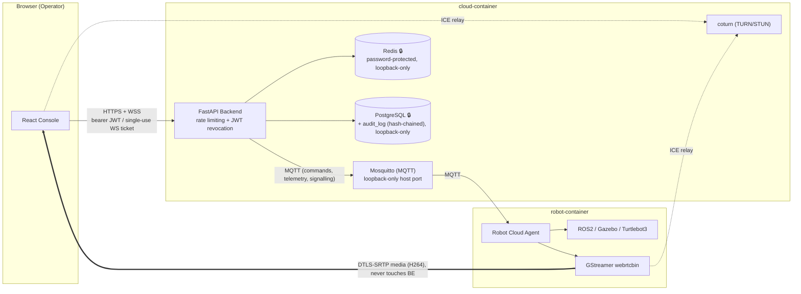
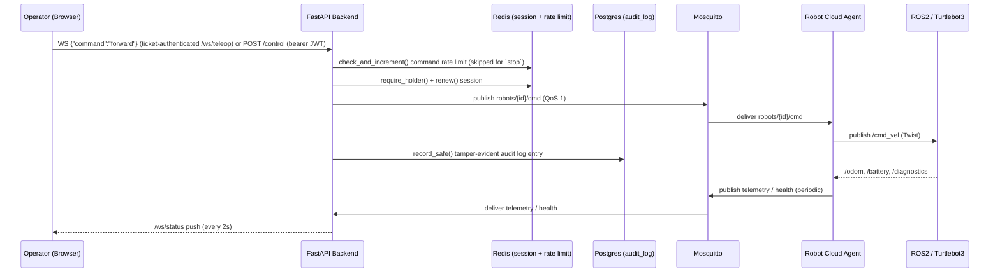
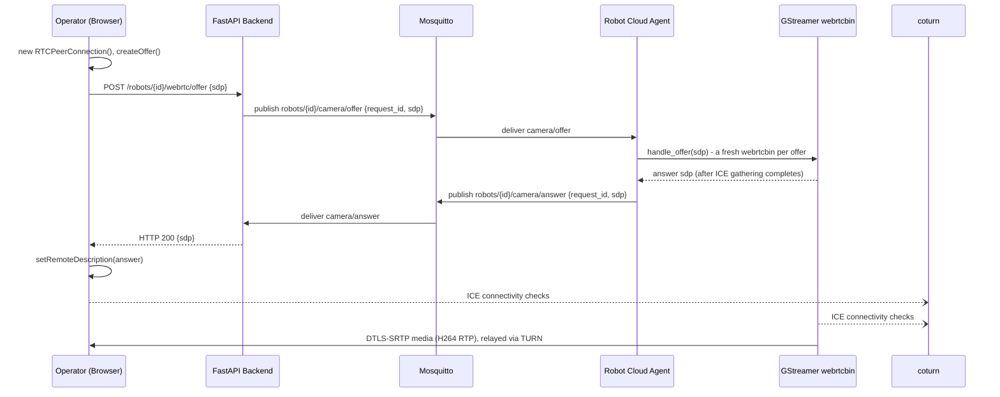
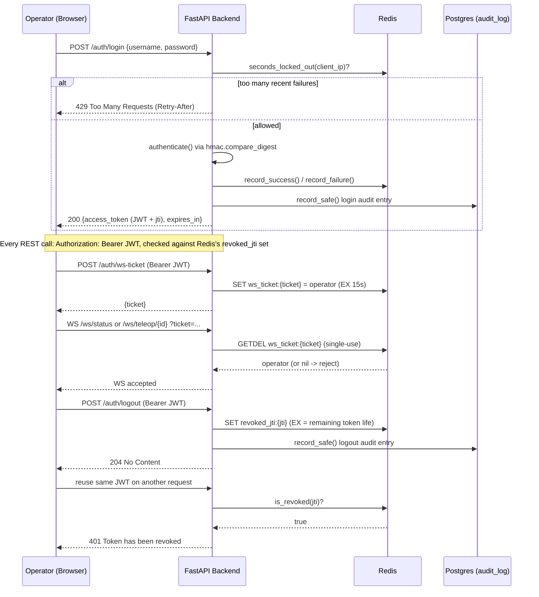

# 00 — Architecture Overview

## What this step is

Before any code, this doc lays out the *shape* of the system we're building: a cloud robotics platform where a human operator in a browser drives a robot that may be sitting in the same room, or — once this moves to AWS — on the other side of the planet. Every later milestone builds one piece of the diagram below. Read this first; it's the map the rest of the docs point back to.

There are two independent data paths through the system. Keeping them separate, both conceptually and in the code, is the single most important architectural decision in this project.

### The system as a whole



Every arrow into `cloud-robotics-net` (the `BE`/`MQ`/`RD`/`PG`/`TURN` box) or `robot-container` is exactly the boundary [`docs/01-repository-structure.md`](01-repository-structure.md) draws between the two containers - nothing crosses it except MQTT and the WebRTC media path, and the media path never passes through `BE` at all. See [`docs/api-reference.md`](api-reference.md) for the concrete contract behind every one of these arrows.

The 🔒 marks on `RD` and `PG` are new since [`docs/12-security-hardening.md`](12-security-hardening.md): both were previously reachable with zero credentials from anywhere that could reach their host-published port - now password-protected (Redis) or holding a tamper-evident audit trail (Postgres), and both loopback-only. `BE`'s own box grew a second job (rate limiting + JWT revocation) it didn't have before. Nothing about the diagram's *shape* changed - the boundary is the same boundary, the arrows go to the same places - only what's enforced at each box did.

### Path 1 — Commands and telemetry (the "control plane")

```
Browser → React → FastAPI → MQTT → Robot Cloud Agent → ROS2 → Turtlebot3
```

The operator clicks an arrow button (or presses an arrow key). That intent travels all the way down to a ROS2 `Twist` message that makes the robot's wheels turn — and telemetry (battery, odometry, health) travels back up the same chain in reverse.



*Static image version (for viewers without live Mermaid rendering): [`docs/images/command-path.png`](images/command-path.png).*

Two steps here didn't exist before [`docs/12-security-hardening.md`](12-security-hardening.md): the rate-limit check (a backstop above the frontend's own 20 cmd/s client-side throttle, deliberately skipped for `stop` - a safety override that could be rate-limited away would defeat its own purpose) and the audit log write (hash-chained, so a later edit or deletion is detectable - see [`scripts/verify-audit-log.py`](../scripts/verify-audit-log.py)). Everything else in this path - the session check, the MQTT publish, the telemetry return trip - is exactly what Milestone 7 built.

### Path 2 — Video (the "media plane")

```
Camera → ROS2 → GStreamer → WebRTC → Browser
```

Video does **not** travel through MQTT or through FastAPI's request path. It's a separate, direct, low-latency peer connection from the robot to the browser. FastAPI's only role in video is *signalling* — introducing the two sides to each other — never touching the video bytes themselves.



Note the last diagram's punchline: `BE` only ever sees SDP *text* (twice - the offer relay in, the answer relay back out), never a single video byte. Every arrow carrying actual media (`VS->>Op`) bypasses the backend entirely, exactly as the Path 2 diagram above promises. See [`docs/08-webrtc-signalling.md`](08-webrtc-signalling.md) for why signalling needed its own MQTT topics, and [`docs/09-frontend.md`](09-frontend.md) for why the TURN hop turned out to be load-bearing, not optional, against a real browser.

*Static image version: [`docs/images/video-path.png`](images/video-path.png). Full system topology as one picture: [`docs/images/architecture-overview.png`](images/architecture-overview.png).*

### Path 3 — Auth and audit (the "security plane")

Added by [`docs/12-security-hardening.md`](12-security-hardening.md), and cross-cutting rather than robot-specific: every request in Path 1 above authenticates and gets recorded through this same machinery, whether it's a login, a WebSocket connection, or a logout.



*Static image version: [`docs/images/security-and-audit-path.png`](images/security-and-audit-path.png).*

Two design choices here are worth calling out because they're easy to get wrong:

- **Why a ticket, not the JWT itself, in the WebSocket URL?** Browsers can't set custom headers on a WS handshake, so *something* has to travel in the URL. A 15-second, single-use ticket is worthless to anyone who reads it back out of an access log or proxy log a moment later - a design confirmed directly, not just argued for: a real WebSocket client reusing the same ticket twice gets rejected with `HTTP 403` on the second attempt.
- **Why does revocation live in Redis instead of the JWT itself?** A JWT is stateless by design - nothing can invalidate one before its own `exp` without *some* server-side state. Keying the blacklist entry's TTL to the token's own remaining lifetime means a revocation record can never outlive the token it revokes, so this list is self-cleaning rather than growing forever.

See [`docs/12-security-hardening.md`](12-security-hardening.md) for the full threat model this closes, what was verified live against the running stack, and what's still deliberately deferred (MQTT transport security, real per-operator accounts, a third-party pentest).

## Why it's needed

### Why split control and media at all?

MQTT is designed for small, frequent, reliable messages (a `Twist` command is a few floats; a heartbeat is a timestamp). It is *not* designed to carry a 30fps H264 video stream — brokers would buckle under the throughput, and every frame would pick up MQTT's store-and-forward latency. WebRTC is designed for exactly the opposite: real-time, low-latency, peer-to-peer media, with built-in congestion control and packet loss recovery, but it's a poor fit for "send a discrete command reliably and know if it was delivered." Using the right protocol for each kind of traffic isn't a nice-to-have here — it's the difference between a robot that responds instantly and one that lags behind every button press.

### Why does the backend never talk to ROS2 directly?

This is the rule stated explicitly in the project spec, and it's worth understanding *why* it's a hard rule rather than a convenience:

- **Isolation boundary.** ROS2 (DDS under the hood) expects to live on a flat, low-latency local network with multicast discovery. The cloud backend will eventually run on AWS, potentially thousands of kilometers from the robot. You cannot — and should not try to — bridge DDS discovery across that gap. MQTT, by contrast, is explicitly designed for exactly this: unreliable, high-latency, NAT-crossing networks (it was invented for oil pipeline telemetry over satellite links).
- **Fleet scalability.** If the backend spoke ROS2 directly, every robot would need its own DDS domain reachable from the cloud, and the backend would need robot-specific ROS2 client code baked in. With MQTT as the only interface, the backend talks to *N* robots through the exact same topic pattern (`robots/{robot_id}/...`) whether *N* is 1 or 10,000. The robot fleet's internal implementation (ROS2 today, something else tomorrow) is completely hidden from the cloud.
- **Security surface.** ROS2/DDS has historically weak default security. MQTT over TLS with per-robot credentials gives us a single, well-understood boundary to secure and audit, instead of exposing a robotics middleware bus to the internet.

This is why the **Robot Cloud Agent** exists as its own component: it's the only thing allowed to speak both languages, translating MQTT ⇄ ROS2 in one place, on the robot's side of the network boundary.

### Why WebRTC for video, and not MJPEG or RTSP?

- **MJPEG** (a sequence of JPEG images over HTTP) has no real compression between frames, burns huge bandwidth, and has no standard way to negotiate through NATs or firewalls at scale.
- **RTSP** assumes a mostly-open network path and a stateful streaming session per client; it doesn't traverse NATs well without extra infrastructure (and most browsers can't speak it natively at all).
- **WebRTC** is built into every modern browser, does ICE/STUN/TURN NAT traversal out of the box, negotiates codecs, adapts bitrate to the network in real time, and — critically for a teleoperation use case — optimizes for *low latency* over *perfect quality*, which is exactly the tradeoff you want when a human is driving a robot based on what they see.

### Why does this have to survive the move to AWS unchanged?

Because the alternative — building a "local demo" architecture now and a "real" architecture later — means throwing away validated work and re-learning the same lessons twice. Every technology chosen here has a direct, well-trodden AWS equivalent:

| Local (this project) | AWS equivalent |
|---|---|
| Eclipse Mosquitto (MQTT broker) | AWS IoT Core (MQTT-native) |
| Docker container (robot) | Physical robot / edge device running the same image |
| Docker container (backend) | ECS Fargate / EKS |
| PostgreSQL container | Amazon RDS for PostgreSQL |
| Redis container | Amazon ElastiCache for Redis |
| Local WebRTC signalling over FastAPI WebSocket | Same code, behind an Application Load Balancer |
| `localhost` addresses in config | Environment-variable-driven endpoints (already how this is built) |

None of that table is aspirational — it's why the config loader, MQTT topic design, and container boundaries are being built the way they are from milestone 1 onward. The [AWS Migration Guide](11-aws-migration.md) (final milestone) will make this concrete with actual AWS resources.

## What it does

This doc itself doesn't ship code. What it establishes, that every later milestone will be held to:

1. **Two containers, one boundary.** `robot-container/` only ever speaks ROS2 internally and MQTT externally. `cloud-container/` only ever speaks MQTT to reach the robot — never ROS2.
2. **Two data paths, two protocols.** Commands/telemetry ride MQTT. Video rides WebRTC, signalled (not carried) by the backend.
3. **Config over hardcoding.** Every address that differs between "my laptop" and "AWS" is a config value, never a literal, from the very first working container.

The first two diagrams were added in Milestone 11's final documentation pass, once every arrow in them had actually been built and verified (Milestones 1-10) - drawing the topology before any of it existed would have been a guess; drawing it now is a description of something real. The third (Path 3, auth and audit) was added post-Milestone-11 alongside [`docs/12-security-hardening.md`](12-security-hardening.md), for the same reason: every arrow in it is something that was built and verified live against the running stack, not proposed. See [`docs/api-reference.md`](api-reference.md) for the exact contract behind each arrow, and [`docs/11-aws-migration.md`](11-aws-migration.md) for how this same topology maps onto real AWS infrastructure.

The next doc, [01 — Repository Structure](01-repository-structure.md), turns this into the actual folders and files created in Milestone 1.
