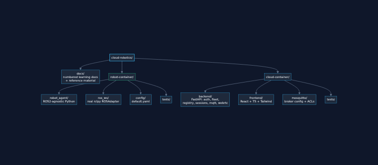

# 01 — Repository Structure

## What this step is

Milestone 1 creates no application code — it creates the *skeleton* the rest of the project grows into: two top-level containers, each split into the sub-folders that the master spec calls for, with every folder holding a short `README.md` explaining its purpose. This doc walks through that skeleton and the reasoning behind it.

## Why it's needed

### Why two top-level containers, not one?

`robot-container/` and `cloud-container/` are separated because **they will run on different hardware in production**, full stop:

- `robot-container` runs *on or next to the robot* — today that's Docker on your laptop standing in for the robot's onboard compute; tomorrow it's a real container (or bare process) on a Jetson/companion computer bolted to a physical Turtlebot3.
- `cloud-container`'s pieces (FastAPI, Mosquitto, Redis, Postgres, React) run in AWS — today that's Docker on the same laptop for convenience, but there is no future world where the fleet-management backend and the robot's onboard ROS2 stack share a machine.

Building them as two independently-runnable containers *now*, communicating only over MQTT/network, is what makes "swap `localhost` for an AWS endpoint" the only change needed later (see [00-overview.md](00-overview.md)). If they were one container with in-process calls between "robot code" and "backend code," separating them later would mean rewriting the interface, not just changing a config value.

### Why these specific sub-folders?

Each folder maps to one responsibility, so that a new contributor (or future you) can find code by asking "what is this thing's job?" rather than "when was this file added?" A flat `src/` with everything mixed together is what gets rewritten when the project grows past a weekend prototype — the spec explicitly avoids that ("avoid monolithic files... every module should have one responsibility"), and that principle starts at the folder level, not just inside individual Python/TS files.

## What it does

### `robot-container/`

| Folder | Purpose | Filled in during |
|---|---|---|
| `docker/` | Dockerfile(s) and container-build assets for the robot image (ROS2 Humble base, Turtlebot3, Gazebo, Robot Cloud Agent runtime). | Milestone 2 (base image), Milestone 5 (ROS2/Gazebo layers) |
| `robot_agent/` | The Robot Cloud Agent itself — pure Python, deliberately **ROS2-agnostic**. Contains the MQTT client, WebRTC client, command dispatcher, health/heartbeat/watchdog logic, and the `ROSAdapter` *interface* it depends on (not the ROS2 implementation). | Milestone 4 |
| `ros_ws/` | The actual ROS2 workspace (`src/` packages) — Turtlebot3 integration and the concrete `ROSAdapter` implementation that talks to real ROS2 topics/services. This is the *only* place `rclpy`/ROS2 imports are allowed to live. | Milestone 5 |
| `launch/` | ROS2 launch files that bring up Gazebo, Turtlebot3, and the agent's ROS2 node together. | Milestone 5 |
| `config/` | YAML configuration for the robot side: robot ID, MQTT broker address, video bitrate, topic names — never hardcoded in code. | Milestone 2 onward |
| `scripts/` | Operational scripts (entrypoints, dev helpers, simulation bootstrap). | Milestone 2 onward |
| `tests/` | Unit tests for `robot_agent/` (run without ROS2 or hardware, using the mock `ROSAdapter`) and integration tests that do need ROS2. | Milestone 4–5 |
| `docs/` | Robot-side implementation notes that are too low-level for the top-level learning docs. | As needed |

### `cloud-container/`

| Folder | Purpose | Filled in during |
|---|---|---|
| `backend/` | FastAPI application: auth, fleet manager, robot registry, session manager, robot REST API, MQTT service, WebRTC signalling, health/metrics, config, logging — each as its own module. | Milestone 7 |
| `frontend/` | React + TypeScript + Tailwind operator console: Dashboard, Robot (teleop), Settings, Health pages. | Milestone 9 |
| `mosquitto/` | Eclipse Mosquitto broker configuration — listeners, auth, ACLs restricting each robot to its own topic namespace. | Milestone 3 |
| `docker/` | Dockerfile(s) for the backend and frontend images. | Milestone 2 |
| `config/` | YAML configuration for the cloud side: service ports, database URLs, Redis address, JWT settings — again, never hardcoded. | Milestone 2 onward |
| `docs/` | Cloud-side implementation notes. | As needed |
| `tests/` | Backend unit tests, API integration tests, MQTT integration tests. | Milestone 7, 10 |

### How this sets up dependency injection later

Notice `robot_agent/` and `ros_ws/` are *separate folders*, not one `ros2_node/` folder. That split exists so that in Milestone 4, `robot_agent/` can define a `ROSAdapter` **interface** (an abstract base class: `publishCmdVel()`, `subscribeCamera()`, `subscribeOdometry()`, `subscribeDiagnostics()`, `subscribeBattery()`) and be fully unit-tested against a fake implementation of it — with zero ROS2 installed. Only when Milestone 5 arrives does `ros_ws/` provide the *real* implementation of that same interface, injected into the agent at startup. The folder boundary is what makes that boundary enforceable in code review: if a `rclpy` import shows up inside `robot_agent/`, something has leaked across the boundary.

The same pattern repeats in `cloud-container/backend/`: an `MQTTService` module the rest of the backend depends on through an interface, so swapping Mosquitto-over-TCP for AWS IoT Core-over-TLS later (see [00-overview.md](00-overview.md)) touches one module, not the whole backend.

### What was actually created this milestone

- The full folder tree above, every leaf folder holding a `README.md` stub (so git tracks the empty structure and so anyone browsing the repo — not just reading these docs — sees what belongs where).
- Root [`README.md`](../README.md) with the project pitch and roadmap checklist.
- This `docs/` learning framework.
- `git init` + a `.gitignore` covering Python, Node, ROS2 build artifacts, Docker overrides, and secrets — so Milestone 2 onward doesn't accidentally commit `node_modules/`, `__pycache__/`, or `.env` files.

No containers build yet and nothing runs yet — that's Milestone 2, [Docker Foundations](02-docker-foundations.md), next.
