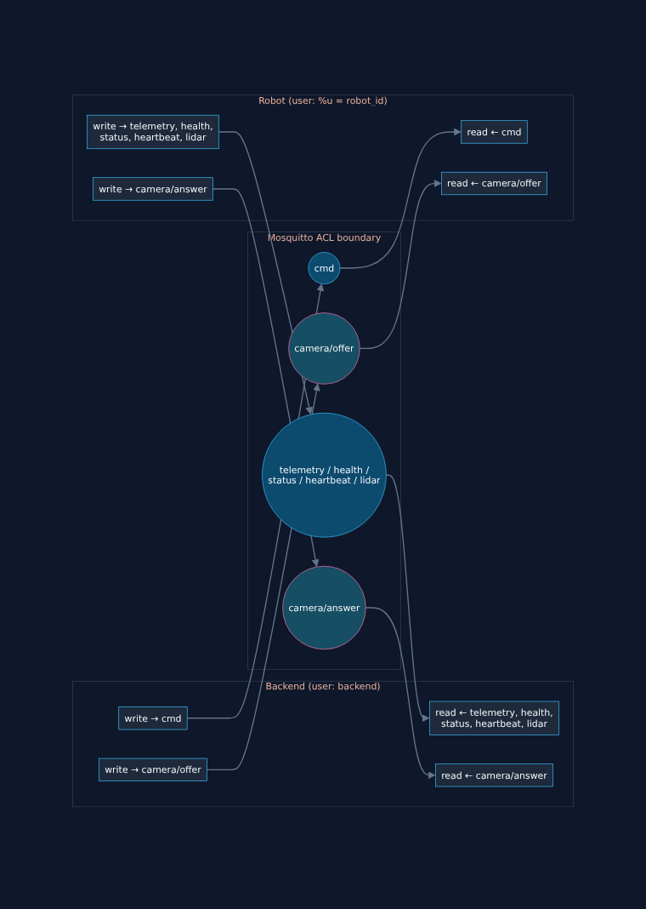

# 03 — The MQTT Layer

## What this step is

Milestone 2 proved the robot could reach the broker at all, with `allow_anonymous true` as a deliberate, temporary shortcut. This milestone removes that shortcut — every client now authenticates with a username and password and is restricted by an access control list (ACL) to exactly the topics its role should touch — and, more importantly, writes down the **formal contract** for all 6 MQTT topics that every later milestone (the real Robot Cloud Agent in Milestone 4, the backend's MQTT service in Milestone 7, WebRTC signalling in Milestone 8) will build against independently. A shared, written contract is what lets components built in different milestones — sometimes months apart — interoperate correctly without either one guessing the other's message format.

## Why it's needed

### Why authentication and ACLs, not just "it's only local anyway"?

Two reasons, one practical and one architectural:

- **Practical**: this project is explicitly meant to mirror what ships to AWS. AWS IoT Core has no "anonymous mode" — every device authenticates with a certificate and is scoped by an IoT policy. Building the local broker to require credentials and enforce per-role permissions means the *concept* of "the robot only gets access to its own namespace" is proven and understood before it needs translating to IoT Core policy documents.
- **Architectural**: an ACL is what actually enforces the isolation boundary described in [00-overview.md](00-overview.md). Nothing about MQTT itself stops a robot from publishing to another robot's topics, or the backend from publishing fake telemetry pretending to be a robot — only an ACL does. Anonymous access meant that boundary existed only in documentation, not in the running system.

### Why `password_file` + `acl_file` instead of Mosquitto's dynamic-security plugin?

Mosquitto 2.x ships a newer `dynamic-security` plugin — a JSON-backed store of users/roles/ACLs, managed live over special `$CONTROL/dynamic-security/v1` MQTT topics rather than flat files. It's genuinely the better fit *once* you need to onboard robots at runtime without restarting the broker. Right now there is exactly one simulated robot, and adding a second would mean generating one more credential — not editing a rule. The classic file-based approach (`password_file` for who-you-are, `acl_file` for what-you're-allowed-to-do) is two plain text formats, far easier to read and reason about while you're still learning what an MQTT ACL even is, and it doesn't foreclose moving to `dynamic-security` later — that's a broker-config change, not something robot or backend code would need to know about either way.

### Why is the robot's MQTT *username* its `robot_id`?

Look at `aclfile`:

```
pattern write robots/%u/telemetry
pattern write robots/%u/health
pattern write robots/%u/status
pattern read  robots/%u/camera/offer
pattern write robots/%u/camera/answer
pattern write robots/%u/heartbeat
pattern write robots/%u/lidar
pattern read  robots/%u/cmd
```

`%u` is Mosquitto substituting in the *authenticated username* of whichever client is connected. By making a robot's username literally equal to its `robot_id`, one rule block scopes **every** robot to exactly its own `robots/{robot_id}/...` namespace — onboarding robot #2 means creating a new credential, never touching this file. This is precisely the role AWS IoT Core policy variables like `${iot:Connection.Thing.ThingName}` play in a single reusable IoT policy attached to every device certificate. Same idea, different syntax — which is exactly the kind of thing worth learning once, locally, before meeting it again in AWS.

The `backend` account, by contrast, gets explicit fixed rules (not a pattern) because there's exactly one backend, and its job is fundamentally different from any robot's: it needs visibility across the *whole* fleet (`robots/+/...`, `+` being MQTT's single-level wildcard), not just its own namespace.

### Why does backend get `read` on telemetry/health/status/heartbeat but not `readwrite`?

Because the backend publishing to those topics would mean the backend *impersonating* a robot's own reported state — a compromised or buggy backend could then lie about a robot's battery level or position. The only thing the backend is trusted to *originate* is commands (`cmd`). Every other topic flows one direction: robot → backend, enforced by the ACL, not just by convention. `test_backend_cannot_publish_robot_telemetry` in the test suite exists specifically to keep this true as the codebase grows — if a future milestone accidentally widens this permission, that test fails.

### Why are credentials generated at container startup instead of committed?

`cloud-container/mosquitto/docker-entrypoint-wrapper.sh` runs `mosquitto_passwd` against environment variables every time the container starts, producing `/mosquitto/config/passwordfile` fresh, before handing off to Mosquitto's real entrypoint. Nothing secret is ever written into a file this repository tracks — only `.env.example` documents the *variable names* with development-only default values, matching the "no hardcoded values" rule that's applied everywhere else in this project. Rotating a password is "change the environment variable and restart the container," not "regenerate a hash and remember to commit it." In the real AWS deployment this entire password-file mechanism disappears — IoT Core uses per-device X.509 certificates instead — but the *shape* of the solution (secrets never live in version control, only their names do) is identical.

### What is a retained message, and why does `status` need one?

By default, an MQTT message only reaches clients that are already subscribed *at the moment it's published* — a client that subscribes a second later gets nothing until the next message arrives. A **retained** message is different: the broker keeps the *last* retained message on a topic and immediately delivers it to any new subscriber, even if it was published hours earlier. `robots/{id}/status` is retained specifically so that a browser opening the operator console doesn't sit there not knowing if the robot is online until the next heartbeat happens to arrive — it gets the true current state the instant it subscribes.

### What is a Last Will and Testament, and why does the robot set one?

A retained "online" message solves knowing a robot *is* up. It doesn't solve a robot going down *ungracefully* — a crash, a network cable pulled, `docker kill` — because there's no code left running to publish "offline." MQTT solves this at the protocol level: when a client connects, it can register a **Will** message with the broker (topic, payload, QoS, retain flag) that the *broker itself* publishes automatically if that client's connection drops without a clean `DISCONNECT`. `heartbeat_placeholder.py` sets this before connecting:

```python
client.will_set(STATUS_TOPIC, status_payload("offline"), qos=1, retain=True)
```

So: clean shutdown → the script publishes `offline` itself. Unclean death → the broker notices the dead TCP connection and publishes `offline` on the robot's behalf. Either way, `robots/{id}/status` always reflects reality, and it's always retained so anyone checking later sees it immediately. This is the single most important reliability pattern in this whole topic contract, worth understanding fully now — the real Robot Cloud Agent (Milestone 4) relies on exactly this mechanism, just with richer payloads.

## What it does

### The topic contract

| Topic | Direction | QoS | Retained | Payload |
|---|---|---|---|---|
| `robots/{id}/cmd` | backend → robot | 1 | no | `{"command": "forward"\|"backward"\|"left"\|"right"\|"stop", "issued_at": <ISO8601>}` |
| `robots/{id}/telemetry` | robot → backend | 0 | no | velocity, position, battery, etc. (finalized in Milestone 4) |
| `robots/{id}/health` | robot → backend | 1 | no | CPU/memory/diagnostics (finalized in Milestone 4) |
| `robots/{id}/status` | robot → backend | 1 | **yes** | `{"robot_id", "status": "online"\|"offline", "timestamp"}` |
| `robots/{id}/camera/offer` | backend → robot | 1 | no | WebRTC **signalling** only (SDP) — never video bytes, see [00-overview.md](00-overview.md). `{"request_id", "sdp"}` — finalized in [Milestone 8](08-webrtc-signalling.md), which split the single `camera` topic this doc originally sketched into this and the row below, once signalling turned out to need both directions. |
| `robots/{id}/camera/answer` | robot → backend | 1 | no | `{"request_id", "sdp"}` — `request_id` echoes the offer's, since MQTT itself has no request/response correlation - see [08-webrtc-signalling.md](08-webrtc-signalling.md). |
| `robots/{id}/heartbeat` | robot → backend | 0 | no | `{"robot_id", "timestamp", "status"}` |
| `robots/{id}/lidar` | robot → backend | 0 | no | `{"robot_id", "timestamp", "angle_min", "angle_max", "angle_increment", "range_min", "range_max", "ranges": [...]}` — added post-Milestone-11 alongside the frontend's LiDAR panel, same shape as ROS2's `sensor_msgs/LaserScan` minus `intensities` (unused, dropped to shrink the payload). `ranges[i]` is `null`, not ROS2's `inf`, where nothing was detected - `Infinity` isn't valid JSON and would break `JSON.parse()` on arrival. See [`docs/api-reference.md`](api-reference.md). |

QoS choices: `cmd`, `health`, `status`, and both `camera/*` topics use QoS 1 (at-least-once — a dropped stop command, a missed offline notice, or a lost SDP offer/answer all matter). `telemetry`, `heartbeat`, and `lidar` use QoS 0 (fire-and-forget — they repeat frequently enough that losing one occasionally is harmless, and QoS 0 has the lowest overhead).



`cmd`'s payload is deliberately a *discrete command name*, not a raw `Twist` (linear/angular velocity). Converting `"forward"` into an actual ROS2 velocity command is explicitly the Robot Cloud Agent's job (Milestone 4) — the wire format stays a stable, simple contract regardless of how that conversion logic evolves later.

### Code changes

- `cloud-container/mosquitto/mosquitto.conf` — `allow_anonymous false`, `password_file`, `acl_file`.
- `cloud-container/mosquitto/aclfile` — the backend and `%u`-pattern robot rules above (no secrets, committed directly).
- `cloud-container/mosquitto/docker-entrypoint-wrapper.sh` — generates the password file from env vars, execs Mosquitto's real entrypoint. Wired in via an `entrypoint:` override in `docker-compose.yml` — still the stock `eclipse-mosquitto:2` image, no custom build needed.
- `robot-container/scripts/heartbeat_placeholder.py` — authenticates as `username=ROBOT_ID`; sets the Will before connecting; publishes retained `status=online` on connect and retained `status=offline` on clean shutdown.
- `docker-compose.yml` / `.env.example` — new `MQTT_BACKEND_USERNAME`, `MQTT_BACKEND_PASSWORD`, `MQTT_ROBOT_PASSWORD` variables. The backend service itself is untouched — it has no MQTT client until Milestone 7, so it doesn't get credentials yet.

### Tests

`cloud-container/tests/test_mqtt_acl.py` — a live integration suite (needs `docker compose up -d` running) proving: anonymous and wrong-password connections are rejected; a full backend→robot command delivery round-trip works; a robot cannot publish into another robot's namespace (verified by an observer client, with a positive control case so the negative assertion is actually trustworthy — MQTT 3.1.1 makes publish-ACL denials silent to the publisher); a robot subscribing with a wildcard broader than its own `%u` pattern (`robots/+/cmd` instead of `robots/{id}/cmd`) still never receives another robot's messages, even though Mosquitto grants that subscription's `SUBACK` rather than rejecting it outright — the boundary is enforced again at message-delivery time, not just at subscribe time (an assumption this test suite got wrong on the first pass and corrected after checking empirically — worth remembering when reasoning about any ACL system: verify what's actually enforced and where, not what seems intuitive); and the backend cannot write robot telemetry (can't impersonate a robot), even though it can legitimately read it.

## Verification

- `docker compose up -d` → `docker compose logs mosquitto` shows the wrapper script running and Mosquitto starting with the new config, no `allow_anonymous` warnings
- `docker compose logs robot` shows an authenticated connect and a retained `status=online` publish
- `mosquitto_sub -h localhost -t 'robots/+/#'` (no `-u`/`-P`) from the host → connection refused
- `pip install -r cloud-container/tests/requirements.txt && pytest cloud-container/tests/test_mqtt_acl.py -v` against the live stack → all cases pass
- `docker compose down` after verification

## Running it yourself

```bash
docker compose up -d
docker compose logs -f robot                 # watch authenticated heartbeats + status
pip install -r cloud-container/tests/requirements.txt
pytest cloud-container/tests/test_mqtt_acl.py -v
docker compose down
```

Next: [04 — The Robot Cloud Agent](04-robot-agent.md) (Milestone 4) replaces `heartbeat_placeholder.py` with the real agent — a `ROSAdapter` interface, a command dispatcher that turns `cmd` messages into ROS2 `Twist` calls, and full telemetry/health publishing — built and unit-tested against a mock `ROSAdapter` before any ROS2 code exists.
