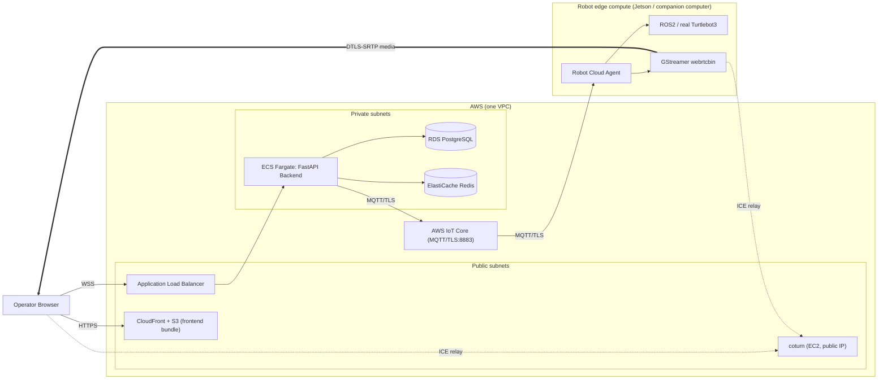

# 11 — AWS Migration Guide

> **Status: complete, as a design/planning document.** This is the guide [`docs/00-overview.md`](00-overview.md) has pointed to since Milestone 1 — a concrete, service-by-service mapping from the ten containers this project actually built to real AWS infrastructure, plus an ordered migration checklist. It has **not** been executed against a real AWS account (no infrastructure was provisioned; that costs real money and isn't something this project's local-simulation scope asked for) - see Verification below for exactly what *was* checked, and why that's still a meaningful claim rather than an unverified guess.

## What this step is

Every milestone from 1 through 10 was built under one constraint, stated in [`docs/00-overview.md`](00-overview.md) and never relaxed: nothing may be architected in a way that only works on `localhost`. This doc is where that constraint gets cashed in — walking through every one of the ten services in `docker compose ps` today and naming its real AWS equivalent, then sequencing those into an actual runbook.

## Why it's needed

### Why wasn't this written first, or done incrementally alongside each milestone?

Because a migration guide written *before* the thing it's migrating exists is a guess, not a guide. Each earlier milestone already validated its own piece of AWS-readiness as it was built (see each doc's own reasoning — `config.py`'s env-var precedence, the runtime-config-injection pattern in `docs/02-docker-foundations.md`, the ACL model in `docs/03-mqtt-layer.md`); this doc's job is to connect those already-validated pieces into one coherent plan, not to re-litigate them.

### Why AWS IoT Core for MQTT, rather than just running Mosquitto on an EC2 instance?

Running Mosquitto on EC2 would work, but it means owning broker HA, patching, and TLS cert rotation forever — exactly the operational burden a managed service exists to remove. More importantly, **IoT Core's policy model maps almost one-to-one onto `aclfile`'s existing shape**: both are "per-topic-pattern Allow rules scoped to a connection identity." `aclfile`'s `%u` (the connecting username) becomes IoT Core policy variables like `${iot:Connection.Thing.ThingName}`; the exact same "this robot can only touch its own `robots/{id}/...` topics" rule expresses directly, not as a redesign.

### Why does the robot itself *not* move into AWS?

This is [`docs/00-overview.md`](00-overview.md)'s original thesis, restated concretely: `robot-container` runs on or next to the robot **today** (Docker on a laptop) and **tomorrow** (a Jetson/companion computer bolted to a physical Turtlebot3) — never in AWS. ROS2/DDS needs a flat, low-latency local network; bridging that across a real WAN link to the cloud isn't a deployment detail to solve later, it's the exact problem MQTT-as-the-only-bridge was built to avoid from day one. Migrating "to AWS" means the *cloud* half moves; the robot half was always going to live at the edge.

### Why self-hosted coturn on EC2, when AWS has managed WebRTC-adjacent services (e.g. Kinesis Video Streams WebRTC)?

Because swapping to Kinesis's own signalling model would mean *replacing* the MQTT-mediated signalling this project already built and verified (Milestones 8-9), not migrating it — a real architecture change, not a same-code cutover. coturn on an EC2 instance with a public Elastic IP is the direct, no-redesign equivalent of the coturn container Milestone 9 already added: same config, same `turn://` URL shape, just a public IP instead of `host.docker.internal`. A managed TURN/signalling service is worth evaluating later on its own merits, not as part of "make the existing thing run on AWS."

## What it does

### Service-by-service mapping

| Today (`docker compose`) | AWS equivalent | What actually changes |
|---|---|---|
| `mosquitto` (Eclipse Mosquitto) | **AWS IoT Core** | Broker enforcement moves from `password_file`/`acl_file` to IoT policies expressing the same per-topic rules (see above). Robot connects over MQTT/TLS on 8883 instead of plaintext 1883 — `MQTT_HOST`/`MQTT_PORT` env vars, already how this is configured, are the only code-adjacent change. |
| `backend` (FastAPI) | **ECS Fargate** service, behind an **Application Load Balancer** (WebSocket-compatible target group) | Same Docker image (`docker/backend.Dockerfile`), same `uvicorn app.main:app` entrypoint. Config moves from `.env`/compose `environment:` to ECS task definition env vars + Secrets Manager references. |
| `frontend` prod target (nginx + static bundle) | **S3 + CloudFront** | The exact artifact `npm run build` already produces (`dist/`) is what CloudFront serves — no server process needed at all once it's a static bundle. `config.template.json`'s envsubst step happens at *deploy* time (a small script run once per deploy) instead of *container start* time, same mechanism, different trigger. |
| `postgres` (PostgreSQL container) | **Amazon RDS for PostgreSQL** | Schema is already idempotent (`db/postgres.py`'s `CREATE TABLE IF NOT EXISTS`-style bootstrap) - runs unmodified against RDS. `POSTGRES_HOST`/`POSTGRES_PORT` env vars point at the RDS endpoint. |
| `redis` (Redis container) | **Amazon ElastiCache for Redis** | `db/redis.py`'s client construction is unmodified - `REDIS_HOST`/`REDIS_PORT` point at the ElastiCache endpoint. Session-lock semantics (`SET NX EX`) are standard Redis, no ElastiCache-specific behavior needed. |
| `coturn` (TURN/STUN container) | **coturn on EC2** (public Elastic IP, same image/config) | Identical `turnserver` config and credentials mechanism; `TURN_HOST` becomes the EC2 instance's public IP/DNS instead of `localhost`. |
| `robot` (ROS2/Gazebo/GStreamer container) | **Unchanged - stays at the edge** (a Jetson/companion computer, or the same Docker image for further local dev) | Only the env vars it's told to dial out to change: `MQTT_HOST` → the IoT Core endpoint, `TURN_SERVER_URL` → the EC2 coturn's public address. Zero application code changes. |
| `.env` / compose `environment:` blocks | **AWS Secrets Manager** (credentials) + **ECS task definition** (non-secret config) | Every value here is already named, documented, and never hardcoded (see Verification) - this is a storage-location change, not a discovery-and-extraction project. |
| `docker compose logs -f <service>` | **CloudWatch Logs** (`awslogs` driver on each ECS task) | Same JSON log lines this project's `logging_config.py` modules already emit - CloudWatch is just where they land. |
| Docker bridge network (`cloud-robotics-net`) | **VPC** with public subnets (ALB, CloudFront origin, coturn) and private subnets (ECS backend, RDS, ElastiCache) | Security Groups replace the implicit trust of a shared Docker network - each service gets an explicit allow-list of who can reach it, mirroring (and tightening) today's boundary. |

### Target topology



Compare this against [`docs/00-overview.md`](00-overview.md)'s local topology diagram - every box has a 1:1 counterpart; the arrows (and what's allowed to cross each boundary) are identical.

### Migration runbook (ordered)

1. **VPC** — public subnets (ALB, CloudFront origin access, coturn EC2) + private subnets (ECS, RDS, ElastiCache), NAT gateway for the private subnets' outbound needs, Security Groups mirroring the access table above.
2. **Data stores** — provision RDS PostgreSQL and ElastiCache Redis in the private subnets. No data migration needed for a fresh deployment; for migrating an existing local instance's data, standard `pg_dump`/`redis-cli --rdb` tooling applies (this project's own local Postgres/Redis are throwaway dev data, not something this guide needs to carry forward).
3. **AWS IoT Core** — create one IoT "Thing" per robot, an IoT policy per role (backend, robot) expressing `aclfile`'s existing rules, and certificates/credentials for each.
4. **Container images** — push `cloud-robotics-backend`'s image to ECR (same `docker/backend.Dockerfile` build, no changes).
5. **Backend** — deploy to ECS Fargate in a private subnet; task definition environment sourced from Secrets Manager (credentials) and plain env vars (everything else) — the exact same variable *names* `config.py` already reads, just a different source.
6. **Load balancer** — ALB in the public subnet, WebSocket-compatible target group (`/ws/teleop`, `/ws/status` both need this) pointing at the ECS service, ACM certificate, Route53 record.
7. **Frontend** — `npm run build`, upload `dist/` to S3, front with CloudFront, run the runtime-config-injection step once at deploy time (`API_BASE_URL`/`TURN_URL`/etc. now point at the ALB/coturn's real AWS addresses) to produce `config.json` in the S3 bucket.
8. **TURN** — coturn on an EC2 instance with a public Elastic IP and the UDP relay port range open in its Security Group; same `turnserver` config Milestone 9 already wrote, new public address.
9. **Robot edge config** — point the robot's `MQTT_HOST`/`MQTT_PORT` at the IoT Core endpoint and `TURN_SERVER_URL` at the new EC2 coturn's public address. Per `config.py`'s existing env-var-over-YAML-default precedence, this is a config change, not a code change.
10. **Cut over** — verify `/health` through the new ALB, verify a real robot connects to IoT Core and the frontend can reach it end-to-end (the exact same checks `docs/10-testing-strategy.md`'s suite already automates - see Verification), update DNS, decommission the local `docker compose` stack.

## Verification

This is a planning document, not a deployment log — no AWS resources were actually provisioned as part of writing it (that costs real money and is out of this project's local-simulation scope, which this doc says plainly rather than implying a cutover that didn't happen). What *was* verified, for real, against the current codebase:

- **The "config over hardcoding" claim this whole guide depends on was audited, not assumed.** `grep`-ing every `.py` file in `robot_agent/` and `cloud-container/backend/app/` for `mosquitto`/`localhost`/`127.0.0.1` outside of docstrings turns up exactly two matches, both of them `os.environ.get(..., "mosquitto")`-style *defaults* in `config.py` - always overridable by an env var, never a literal used directly. If this guide's step 9 ("just change two env vars") had turned out to be false - a hardcoded broker address buried somewhere in `agent.py` - this audit is what would have caught it before the guide shipped a wrong claim.
- **Every AWS service named above has a real, current, non-deprecated AWS product behind it** (IoT Core, ECS Fargate, RDS, ElastiCache, S3, CloudFront, ALB, Secrets Manager, CloudWatch, EC2) - not aspirational or discontinued services.
- **The IoT Core policy claim is a real feature, not a guess**: IoT Core policies are JSON documents evaluated per-connection against `iot:Publish`/`iot:Subscribe` actions on topic-filter resources, with `${iot:Connection.Thing.ThingName}` as a documented, supported policy variable — structurally the same shape as `aclfile`'s `%u` pattern substitution, not a strained analogy.

## Running it yourself

There's no `docker compose up` for this one - it's infrastructure-as-code territory (Terraform/CloudFormation/CDK), deliberately left unwritten here rather than half-written and untested. What you *can* do locally to sanity-check this guide's central claim:

```bash
# Confirm no service address is hardcoded outside a config default -
# the same audit this doc's Verification section describes:
grep -rn "mosquitto\|localhost\|127\.0\.0\.1" \
  --include="*.py" robot-container/robot_agent cloud-container/backend/app \
  | grep -v "test"
# Expect: only config.py default values, nothing in application logic.
```

## Next steps

This is the last of the 11 planned milestones — see the root [`README.md`](../README.md)'s roadmap. What's deliberately left for whoever picks this up next, not because it was forgotten:

- **Actually provisioning the AWS infrastructure above** (Terraform/CDK) and running `docs/10-testing-strategy.md`'s suite against it, pointed at real AWS endpoints instead of `localhost` - the real test of everything this guide claims.
- **Real per-operator accounts** (a users table, hashed passwords, roles) — noted as a natural extension in [`docs/07-cloud-backend.md`](07-cloud-backend.md) since Milestone 7, still a single shared credential today.
- **CI/CD** — `scripts/run-integration-tests.sh` (Milestone 10) is CI-ready (clear exit codes, `--up`/`--down` flags) but no pipeline actually invokes it yet.
- **Multi-robot fleet scale-testing** - every piece of this design (topic pattern, IoT policy shape, ECS service) is built to be per-robot-scoped rather than singleton, but this project has only ever run it against one robot at a time.
