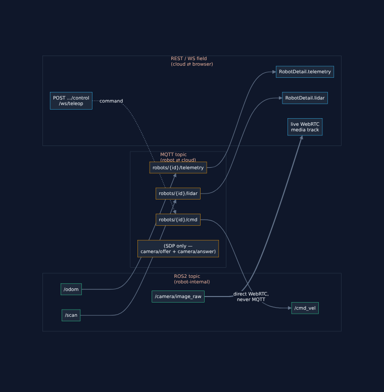

# Configuration Reference

> **Reference material, not a numbered milestone doc** — the same kind of document as [`docs/api-reference.md`](api-reference.md), just for *configuration* instead of *API contracts*: every parameter that controls robot-side or cloud-side behavior, in one place, kept accurate as the project evolves. Read this before changing a config value, adding a new one, or integrating a real robot/AWS — not front-to-back like the numbered docs.

## What this file is for

This project has **one runtime config source of truth**: the root [`.env`](../.env.example) file. Everything else — `docker-compose.yml`'s `environment:` blocks, `robot-container/config/default.yaml`, `cloud-container/backend/app/config.py`'s field defaults — exists to give every value a sane default so `docker compose up` works with zero setup, not to compete with `.env` as a second source of truth. When you need to change something, **`.env` is almost always the only file you touch**; this doc exists to tell you exactly which one, what else it affects, and what to double-check afterward.

## How configuration actually flows

```
.env  →  docker-compose.yml (${VAR:-default})  →  container's real environment  →  app config loader
                                                                                          ↓
                                                    robot: robot_agent/config.py (env > config/default.yaml > field default)
                                                    cloud: backend/app/config.py  (env > config/default.yaml > field default)
```

Both loaders use the **identical precedence rule** — environment variable wins, then `config/default.yaml`, then the Python dataclass/`BaseModel` field default — on purpose (see each file's own header comment). This is *why* moving to AWS later is "change endpoints, not code": the loader never changes, only which layer supplies the value does (env var, from an ECS task definition or Secrets Manager, instead of `.env`).

Two things live *outside* `.env` and are worth knowing about explicitly:
- **`robot-container/config/default.yaml`** — a few robot-only values with no env var wired up at all yet (`intervals.*`, `motion.*`, `video.bitrate_kbps`/`framerate`/`keyframe_interval`/`stun_server`). Changing these means editing this file directly (and rebuilding the robot image — see "Reflections" below), not `.env`.
- **The frontend's runtime config** (`config.json`/`VITE_*`) — not read from `.env` by the browser at all; `docker-compose.yml` composes it from `.env` values at container-start time (dev) or deploy time (prod). See [`docs/02-docker-foundations.md`](02-docker-foundations.md) and [`docs/09-frontend.md`](09-frontend.md).

## Master parameter table

Every `.env` variable, who actually reads it, and what it controls. "Consumed by" is the container that *uses* the value at runtime — several are read by more than one container because they describe a connection between them (e.g. `MQTT_ROBOT_PASSWORD` is used by `mosquitto` to generate the robot's credential *and* by `robot` to authenticate with it - **these two must always agree**, which is exactly why they're driven by one shared variable instead of two).

### Robot identity & health

| Variable | Consumed by | Read in | Purpose |
|---|---|---|---|
| `ROBOT_ID` | `robot`, `mosquitto` | `robot_agent/config.py`; `docker-entrypoint-wrapper.sh` (generates the MQTT password file entry) | The robot's identity everywhere: its MQTT *username* (`aclfile`'s `%u` pattern), and the `{id}` in every `robots/{id}/...` topic. **Changing this is effectively "provisioning a different robot"** — see "Adding a second robot" below. |
| `ROBOT_HEALTH_PORT` | `robot` | `robot_agent/config.py`, `docker-compose.yml` port mapping | Local `GET /health`/`GET /metrics` for the container orchestrator (`robot_agent/health_server.py`) - separate from the MQTT `health` topic, which reports to the fleet backend instead. |

### Camera

| Variable | Consumed by | Read in | Purpose |
|---|---|---|---|
| `CAMERA_DEVICE` | `robot` | `webcam_driver.py` (`cv2.VideoCapture(device, cv2.CAP_V4L2)`) | The **V4L2 capture device node** feeding `/camera/image_raw` - e.g. `/dev/video0`. Must be a `/dev/videoN` capture node, **not** `/dev/mediaN` (a media-controller node - OpenCV's V4L2 backend can't capture from those; `v4l2-ctl --list-devices` shows which is which on your machine). Only actually passed into the container if you also apply `docker-compose.camera.yml` - see [`docs/06-video-streaming.md`](06-video-streaming.md). There is no "camera port" in this system - the camera is a local device passthrough, not a network stream; the closest thing to a port is `TURN_PORT` below, which is about *transporting* the encoded video over WebRTC, not the camera itself. |
| `CAMERA_WIDTH` / `CAMERA_HEIGHT` / `CAMERA_FPS` | `robot` | `webcam_driver.py` (`cap.set(cv2.CAP_PROP_*)`) | Requested capture resolution/rate - the camera may not honor an unsupported combination silently; check with `v4l2-ctl --device=/dev/video0 --list-formats-ext` first. |
| `CAMERA_TEST_PATTERN_FALLBACK` | `robot` | `webcam_driver.py` | Off (`false`) by default on purpose - a missing camera should fail loudly (repeated warnings, zero frames), not silently fake video. Set `true` only on a dev/CI box with no webcam at all. |

### MQTT (Eclipse Mosquitto)

| Variable | Consumed by | Read in | Purpose |
|---|---|---|---|
| `MQTT_HOST` / `MQTT_PORT` | `robot`, `backend` | `robot_agent/config.py`, `backend/app/config.py` | Broker address. `mosquitto` (the Docker service name) locally; a real broker's TLS endpoint (AWS IoT Core: port 8883) after migration - see "Migrating to a real robot / AWS" below. |
| `MQTT_BACKEND_USERNAME` / `MQTT_BACKEND_PASSWORD` | `mosquitto`, `backend` | `docker-entrypoint-wrapper.sh` (writes the password file), `backend/app/config.py` | The backend's single shared MQTT identity - `readwrite` on `cmd`, `write` on `camera/offer`, **read-only** everywhere else (`aclfile` - see [`docs/03-mqtt-layer.md`](03-mqtt-layer.md) for why). |
| `MQTT_ROBOT_PASSWORD` | `mosquitto`, `robot` | same as above; `robot_agent/config.py` | The one credential every robot shares *today* (username is always `ROBOT_ID`, so this is the only secret part). **Must match between `mosquitto` and `robot`** - see "Reflections" below for what breaks if it doesn't, and "Adding a second robot" for why this won't scale as-is. |

### Redis & PostgreSQL

| Variable | Consumed by | Read in | Purpose |
|---|---|---|---|
| `REDIS_HOST` / `REDIS_PORT` | `backend` | `backend/app/db/redis.py` | Live fleet state (status/telemetry/health/lidar) + session locks - see [`docs/07-cloud-backend.md`](07-cloud-backend.md). |
| `POSTGRES_HOST` / `POSTGRES_PORT` / `POSTGRES_DB` / `POSTGRES_USER` / `POSTGRES_PASSWORD` | `backend`, `postgres` | `backend/app/db/postgres.py`; `postgres`'s own image env vars | Durable robot registry + control-session audit log. |

### Backend (FastAPI) / Auth

| Variable | Consumed by | Read in | Purpose |
|---|---|---|---|
| `BACKEND_PORT` | `backend`, `frontend` (indirectly, via `API_BASE_URL`) | `backend/app/config.py`, `docker-compose.yml` port mapping | The REST/WebSocket port the browser talks to. |
| `LOG_LEVEL` | `robot`, `backend` | both `config.py`s | Structured JSON log verbosity - the one variable that's genuinely identical in name and meaning on both sides. |
| `OPERATOR_USERNAME` / `OPERATOR_PASSWORD` | `backend` | `backend/app/config.py` | The single shared operator login (see [`docs/07-cloud-backend.md`](07-cloud-backend.md) - real per-operator accounts are a documented future extension, not built yet). |
| `JWT_SECRET` / `JWT_ALGORITHM` / `JWT_EXPIRY_SECONDS` | `backend` | `backend/app/config.py` | Session token signing. **Change `JWT_SECRET` before anything resembling a real deployment** - the shipped default is deliberately obvious so nobody mistakes it for safe. |
| `SESSION_TTL_SECONDS` | `backend` | `backend/app/config.py` | How long an operator's exclusive control lock survives with no renewal before another operator can take it - the session-layer equivalent of the robot's own MQTT Last-Will-and-Testament. |

### Frontend (React)

| Variable | Consumed by | Read in | Purpose |
|---|---|---|---|
| `FRONTEND_PORT` | `frontend` | `docker-compose.yml` port mapping | The port you open in a browser. |
| `API_BASE_URL` | `frontend` | `src/config.ts` (via `VITE_API_BASE_URL` in dev, `/config.json` in prod) | Must be **browser-reachable** - `http://localhost:8000` locally, never the internal Docker service name `backend`. See [`docs/02-docker-foundations.md`](02-docker-foundations.md)'s runtime-config-injection pattern. |

### TURN (coturn) — WebRTC relay

| Variable | Consumed by | Read in | Purpose |
|---|---|---|---|
| `TURN_USERNAME` / `TURN_PASSWORD` | `coturn`, `robot`, `frontend` | `coturn`'s own `--user=` flag; composed into `TURN_SERVER_URL` (robot) and `VITE_TURN_*`/`TURN_*` (frontend) | One shared long-term credential (same "no per-identity provisioning yet" shape as MQTT/operator creds). **Must match across all three** - `docker-compose.yml` already derives all three from these two variables, so editing `.env` alone is sufficient; nothing to keep in sync by hand. |
| `TURN_PORT` / `TURN_MIN_PORT` / `TURN_MAX_PORT` | `coturn`, `robot`, `frontend` | `coturn` CLI flags; `TURN_SERVER_URL`; `VITE_TURN_URL`/`TURN_URL` | Listening port + relay allocation port range. `coturn` runs with `network_mode: host` specifically so this whole range doesn't need per-port Docker publishing - see `docker-compose.yml`'s own comment. |
| `TURN_HOST` | `frontend` | `VITE_TURN_URL`/`TURN_URL` | Must be **browser-reachable** (`localhost` locally) - same reasoning as `API_BASE_URL`. Note this is *not* how the robot reaches coturn (the robot uses `host.docker.internal`, hardcoded in `docker-compose.yml`'s `robot` service, since it's a container-to-host path, not a browser path). |

### Robot GUI (Gazebo)

| Variable | Consumed by | Read in | Purpose |
|---|---|---|---|
| `DISPLAY` | `robot` | `simulation.launch.py` (checked directly, not through `robot_agent/config.py` - this only matters for the ROS2 launch, never the Python agent) | **Not set in `.env`** - read from the *host's own* environment at `docker compose up` time (see `docker-compose.yml`: `DISPLAY: ${DISPLAY:-}`). If set, Gazebo's GUI (`gzclient`) launches automatically alongside the headless simulation. See root [`README.md`](../README.md)'s "Watching the simulation visually." |

### Robot-only, YAML-configured (no `.env` variable yet)

These live in `robot-container/config/default.yaml` only. Change them by editing that file directly, then rebuilding the robot image (`docker compose build robot` - Python source and YAML are both baked in at build time, unlike the backend's bind-mounted dev setup).

| Key | Default | Purpose |
|---|---|---|
| `intervals.heartbeat_seconds` | `1.0` | MQTT `heartbeat` topic publish rate. |
| `intervals.telemetry_seconds` | `1.0` | MQTT `telemetry` topic publish rate (independent of `/odom`'s own ROS2 rate - the agent always publishes its *latest cached* sample on this schedule). |
| `intervals.health_seconds` | `2.0` | MQTT `health` topic publish rate. |
| `intervals.lidar_seconds` | `0.5` | MQTT `lidar` topic publish rate (independent of `/scan`'s own ~5Hz ROS2 rate - same "cache latest, republish on our own schedule" pattern). |
| `intervals.watchdog_check_seconds` / `watchdog_unhealthy_after_seconds` | `5.0` / `15.0` | How often the watchdog checks MQTT connectivity, and how long a disconnection has to persist before it triggers `restart()`. |
| `motion.linear_speed` / `motion.angular_speed` | `0.2` m/s / `0.5` rad/s | The fixed speed every `forward`/`backward`/`left`/`right` command actually drives at - see `robot_agent/dispatcher.py`. There is no "velocity topic" to configure separately from this: `/cmd_vel` is the ROS2 topic name (fixed, Turtlebot3/Gazebo convention), these two values are what magnitude gets published to it. |
| `video.bitrate_kbps` / `framerate` / `keyframe_interval` | `1000` / `15` / `30` | GStreamer H264 encoder settings - see [`docs/06-video-streaming.md`](06-video-streaming.md). `framerate` should generally match `CAMERA_FPS`. |
| `video.stun_server` | `stun://stun.l.google.com:19302` | Public STUN fallback, used alongside (not instead of) the TURN relay above. |
| `video.turn_server` | `""` (empty) | **Not actually set here in practice** - `robot_agent/config.py` reads `TURN_SERVER_URL` from the environment first, which `docker-compose.yml` always provides (composed from the `TURN_*` variables above); this YAML key is only the fallback if that env var is somehow absent. |

## Topic reference: one data type, three names

This is the table the "scan topic, velocity topic" question is really asking for - the **same piece of data** has a different name at each layer it crosses, and this is where to look them all up at once. See [`docs/api-reference.md`](api-reference.md) for the full payload shapes.



| Data | ROS2 topic (robot-internal only) | MQTT topic (crosses robot ⇄ cloud) | REST/WS field (crosses cloud ⇄ browser) |
|---|---|---|---|
| Velocity command | `/cmd_vel` (`geometry_msgs/Twist`) | `robots/{id}/cmd` | `POST /robots/{id}/control` body `{command}`, or `/ws/teleop/{id}` messages |
| Odometry | `/odom` (`nav_msgs/Odometry`) | `robots/{id}/telemetry` | `RobotDetail.telemetry` (`GET /robots/{id}`) |
| Camera | `/camera/image_raw` (`sensor_msgs/Image`) | *(none - never crosses MQTT, see below)* | Live WebRTC media track (`POST /robots/{id}/webrtc/offer` signals it) |
| LIDAR scan | `/scan` (`sensor_msgs/LaserScan`) | `robots/{id}/lidar` | `RobotDetail.lidar` (`GET /robots/{id}`) |
| Diagnostics | *(no real ROS2 topic - Turtlebot3's Gazebo stack doesn't model this)* | `robots/{id}/health` | `RobotDetail.health` (`GET /robots/{id}`) |
| Liveness | *(n/a)* | `robots/{id}/heartbeat`, `robots/{id}/status` | `RobotSummary.status`/`.last_seen` (`GET /robots`, `/ws/status`) |
| WebRTC signalling | *(n/a - SDP only, generated by the browser/`VideoStreamer`)* | `robots/{id}/camera/offer`, `robots/{id}/camera/answer` | `POST /robots/{id}/webrtc/offer` |

**Camera is the one row that's structurally different**: every other row rides MQTT because it's small, frequent, structured data - a natural fit. Video is high-bandwidth, real-time media, which MQTT was never meant to carry (see [`docs/00-overview.md`](00-overview.md)'s "why split control and media at all"). MQTT only carries the SDP *offer/answer* (a text negotiation, a few KB, once per connection) - the actual video bytes go over a direct WebRTC/DTLS-SRTP peer connection, robot → browser, that never touches the backend.

Topic **names** themselves (`cmd`, `telemetry`, `lidar`, etc.) are fixed in code (`robot_agent/topics.py` and `backend/app/mqtt/topics.py`, which must always agree - see [`docs/03-mqtt-layer.md`](03-mqtt-layer.md)), not `.env`-configurable. What *is* configurable is the `{id}` segment, via `ROBOT_ID`.

## Port reference

| Port | Service | Published to host? | Notes |
|---|---|---|---|
| `3000` (`FRONTEND_PORT`) | frontend | Yes | The URL you open in a browser. |
| `8000` (`BACKEND_PORT`) | backend | Yes | REST + WebSocket API. |
| `8080` (`ROBOT_HEALTH_PORT`) | robot | Yes | Local health/metrics, for the orchestrator - not the fleet-facing `health` MQTT topic. |
| `1883` (`MQTT_PORT`) | mosquitto | Yes (dev convenience) | Broker itself only ever reached internally by `robot`/`backend` via the service name `mosquitto`; host publishing is for `mosquitto_pub`/`_sub` debugging. |
| `6379` (`REDIS_PORT`) | redis | Yes (dev convenience) | Same reasoning as MQTT above. |
| `5432` (`POSTGRES_PORT`) | postgres | Yes (dev convenience) | Same reasoning. |
| `3478` (`TURN_PORT`) | coturn | Yes (`network_mode: host`) | STUN/TURN control port. |
| `49160`-`49200` (`TURN_MIN_PORT`-`TURN_MAX_PORT`) | coturn | Yes (`network_mode: host`) | TURN relay allocation range - the actual media (video RTP, once relayed) flows through here. |
| *(none - dynamic, ICE-negotiated)* | WebRTC media (robot ⇄ browser) | N/A | No fixed port; ICE picks ephemeral UDP ports on both ends, relayed through the TURN range above when direct connectivity isn't possible (see [`docs/09-frontend.md`](09-frontend.md) for why that's the normal case here, not an edge case). |

## Reflections: what to check after changing something

A few of these bit this project during its own development - included because "it worked for me while building it" is a better precaution than a generic warning.

- **Any `mosquitto`-related variable** (`MQTT_BACKEND_USERNAME/PASSWORD`, `MQTT_ROBOT_PASSWORD`, `ROBOT_ID`) — editing `.env` alone is not enough. `docker-entrypoint-wrapper.sh` only regenerates the password/ACL files at **container start**, and Mosquitto only reads them at **broker start** - it does not hot-reload. Run `docker compose up -d --no-deps mosquitto` (or `docker compose restart mosquitto`) after changing any of these, or every client still authenticates with the *old* credential until you do. (Confirmed directly: forgetting this step is exactly why a topic ACL change silently didn't take effect once during this project's own development.)
- **`OPERATOR_USERNAME`/`OPERATOR_PASSWORD`, `JWT_*`, or any other `backend`-only variable** — the `backend` service's dev command runs `uvicorn --reload`, which watches *Python source files*, not environment variables. `docker compose up -d --no-deps backend` (a recreate) is required to pick up a changed env var; a plain restart of the same container will not, since the variable was baked in at container-creation time. (Also confirmed directly this session: changing `OPERATOR_USERNAME` had no effect until the container was recreated.)
- **Anything in `robot-container/config/default.yaml`** — this is baked into the image at build time (`COPY config ./config` in `docker/Dockerfile`), unlike the backend's bind-mounted `app/`. `docker compose build robot` is required, not just a recreate.
- **`CAMERA_DEVICE`/`ROBOT_ID`/etc. for the `robot` service in general** — a plain `docker compose up -d --no-deps robot` (recreate, no rebuild) is enough for anything that's *only* an environment variable read at process start - which is everything in `.env` except the YAML-only keys above.
- **`ROBOT_HEALTH_PORT`/`BACKEND_PORT`/`FRONTEND_PORT`** — changing a *host-published* port requires a recreate of that specific service (`docker compose up -d --no-deps <service>`); nothing downstream needs to know, since every other service reaches it by internal Docker service name, never through the host-published port.

## Adding a second robot (not built yet, but here's the shape)

Today's `.env`/`docker-compose.yml` models **exactly one robot** - `ROBOT_ID` and `MQTT_ROBOT_PASSWORD` are both singular. A second robot needs, at minimum:
1. A second `robot` service block in `docker-compose.yml` (or a Compose scale/template) with its own `ROBOT_ID` and its own `MQTT_ROBOT_PASSWORD`.
2. `docker-entrypoint-wrapper.sh` extended to generate a password-file entry per robot, not one - it currently assumes a single `ROBOT_ID`/`MQTT_ROBOT_PASSWORD` pair.
3. Nothing else changes: `aclfile`'s `pattern` rules already use `%u` (whichever robot is connecting), the backend's MQTT subscriptions already use fleet-wide `robots/+/...` wildcards, and the frontend's Dashboard already renders however many robots `GET /robots` returns. This is exactly the "one MQTT topic pattern handles *N* robots" design [`docs/00-overview.md`](00-overview.md) describes - the credential-provisioning step is the only genuinely single-robot assumption left in the system.

## Migrating to a real robot

| What changes | What doesn't |
|---|---|
| `MQTT_HOST`/`MQTT_PORT` → the real broker's address (still just an env var) | Every topic name, every payload shape, `robot_agent/`'s entire codebase |
| `CAMERA_DEVICE` → the real robot's actual camera device node (`v4l2-ctl --list-devices` on the robot's own computer) | `webcam_driver.py` itself - it already only assumes a V4L2 device, nothing Gazebo-specific |
| `MQTT_ROBOT_PASSWORD` → a real, unique-per-robot secret, not a shared dev password | The authentication *mechanism* (username = robot ID) |
| `RealROSAdapter`'s `/odom` and `/scan` sources → whatever your real robot's navigation stack actually publishes on those topic names (may need remapping if your robot uses different topic names) | The `ROSAdapter` interface itself, and everything in `robot_agent/` that depends only on it |
| Gazebo/`simulation.launch.py` → **removed entirely**, replaced by whatever launches your real robot's own driver stack | `robot_agent/main.py`'s injection point - it already expects "some `ROSAdapter` implementation," real or simulated |

**Precautions**: verify `/cmd_vel` on the real robot expects the same `geometry_msgs/Twist` sign conventions `CommandDispatcher` assumes (`motion.linear_speed`/`angular_speed` - test at low speed on a bench, wheels off the ground, before anything drives on the floor). Confirm the real LIDAR's `angle_min`/`angle_max`/`range_min`/`range_max` (a real LDS-01 vs. this project's simulated one may differ) - `LidarView` on the frontend renders whatever it's told, so a wrong `range_max` would just misrender, not crash, but it's worth sanity-checking once against `docs/api-reference.md`'s documented shape. A real camera's actual resolution/format may need `CAMERA_WIDTH`/`HEIGHT`/`FPS` and `video.framerate` to be revisited together, not just the camera side.

## Migrating to AWS

This section is the *configuration-level* companion to [`docs/11-aws-migration.md`](11-aws-migration.md), which covers the infrastructure mapping in full - read that first for the "why," this is the quick "which `.env` variable becomes what" lookup:

| Today (`.env`) | Becomes |
|---|---|
| `MQTT_HOST`/`MQTT_PORT` | AWS IoT Core's account-specific endpoint, port 8883 (TLS) |
| `MQTT_ROBOT_PASSWORD` | An X.509 certificate + IoT policy per robot (IoT Core is certificate-based, not password-based - see `docs/11-aws-migration.md`'s IoT Core section) |
| `MQTT_BACKEND_USERNAME`/`PASSWORD`, `POSTGRES_PASSWORD`, `JWT_SECRET`, `TURN_PASSWORD`, etc. (every secret) | AWS Secrets Manager entries, referenced by ARN in the ECS task definition instead of a literal env var value |
| `POSTGRES_HOST`/`PORT` | An RDS for PostgreSQL endpoint |
| `REDIS_HOST`/`PORT` | An ElastiCache for Redis endpoint |
| `API_BASE_URL` | The real ALB/CloudFront-fronted domain, still browser-reachable, just no longer `localhost` |
| `TURN_HOST`/`TURN_PORT`/etc. | A coturn instance's real public IP/DNS (EC2), same config shape, different address |
| `DISPLAY` | Not applicable - there's no display to forward on an ECS task or a headless edge device either; `simulation.launch.py`'s own conditional already handles this identically to any other headless host |

**Precaution**: every value above is *already* an environment variable read the same way in both places - the migration is "change the value," never "change the code that reads it." If you ever find yourself editing a `.py`/`.tsx` file to make a migration work, that's a signal the value should have been in this table (i.e. in `.env`/config) from the start, not hardcoded - worth fixing at the source rather than treating as a one-off migration patch.
