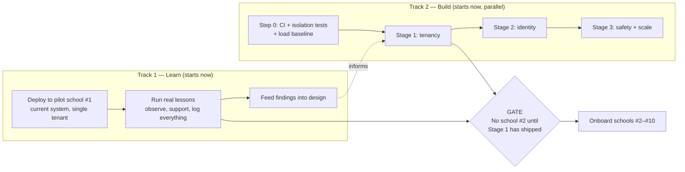

# Execution Strategy — How to Build Toward the Target

**Third of three.** [`architecture-assessment.md`](architecture-assessment.md) says what is wrong. [`target-architecture.md`](target-architecture.md) says what to build. This document says **how to actually get there** — sequencing, working practices, quality gates, and the failure modes that kill projects like this one even when the design is correct.

The design is the easy part. Most systems with a good target architecture still fail in execution: the six-month refactor branch that never merges, the rewrite that loses features, the migration that can't be rolled back, the safety incident that ends the project. This document is about not doing that.

---

## 1. The core strategy

There is a real tension in the assessment's conclusion. It says *build tenancy before the second institution* — but you learn more from one real school using the system for a month than from three months of designing in the abstract. Waiting to build tenancy before talking to any school is as wrong as onboarding ten schools without it.

**The resolution: two parallel tracks and one hard gate.**



*Static image version: [`docs/images/execution-tracks.png`](images/execution-tracks.png).*

**Why this works.** One institution on the current system is genuinely safe — a single tenant needs no tenant isolation, which is exactly why the system is rated 7/10 for that case. The risk only appears at school #2. So pilot immediately, learn from real classrooms, and let those findings shape the tenancy work while it is still cheap to change.

**The gate is non-negotiable and worth writing down somewhere visible.** Onboarding a second institution before Stage 1 is what converts a two-to-three-week migration into a quarter-long one with live customer data in it. Every commercial pressure you will face pushes against this gate. Decide now, while it costs nothing.

---

## 2. Step 0 — before the first line of migration code

Three things must exist before the tenancy work starts. Together they are perhaps two weeks, and they are the safety net under everything after.

### 2.1 CI, running the tests that already exist

You have 80 tests and nothing invokes them automatically. That is the cheapest possible win: a GitHub Actions workflow running `scripts/run-integration-tests.sh` plus `make security-audit` on every push.

**This is a correction to my own earlier ordering.** [`target-architecture.md`](target-architecture.md) places CI in Stage 5 with the other operational work. That is wrong for execution purposes: CI is not an operational nicety, it is the thing that tells you whether a cross-cutting refactor broke something three modules away. Doing a tenancy migration without it is working blind. **Move it to first.**

### 2.2 An adversarial isolation test suite — written *before* the tenancy code

This is the highest-leverage single artifact in the whole plan.

The invariant is "no tenant can ever observe another tenant's data." Encode that as an executable test *now*, while it fails for the obvious reason that tenancy does not exist yet:

```python
# Seed two tenants with one robot each, then for EVERY route on the app,
# authenticate as tenant A and attempt to reach tenant B's resource.
# Assert: 403/404/empty — never B's data.

@pytest.mark.parametrize("route", all_routes(app))   # enumerated, not hand-listed
async def test_no_cross_tenant_access(route, tenant_a_token, tenant_b_fixtures):
    response = await call(route, token=tenant_a_token, target=tenant_b_fixtures)
    assert response.status in (403, 404) or response.json() == []
```

**The critical detail is `all_routes(app)` — enumerate the routes from the application, never hand-maintain a list.** A future contributor who adds an endpoint and forgets tenant scoping gets a failing test they did not write, on a route they did not think about. That is the difference between a test suite and a guardrail.

Add the same shape for the datastore layer: query as the application's DB role with no tenant context set, and assert zero rows come back — proving RLS is doing the work rather than the application's `WHERE` clause.

### 2.3 A load-test harness, to replace estimates with measurements

The assessment's scaling numbers (≈25M Redis ops/sec at Phase C, ≈15k msg/sec ingest) are *calculated from the code's query patterns, not measured*. They are directionally right and good enough to justify the design, but you should not optimise against arithmetic.

Build a harness that simulates N robots publishing and M dashboards subscribing, and record a baseline **today**. Then every scaling change has a before-and-after number. Without this you will not know whether the event-driven fan-out actually helped, and you will not know when you have done enough.

---

## 3. How to work

### Vertical slices, not horizontal layers
The tempting order is "all the schema work, then all the API work, then the frontend." It produces months with nothing shippable and a big-bang integration at the end.

Tenancy is inherently cross-cutting, so the discipline is: **make one endpoint tenant-aware end to end first** — schema, RLS policy, token claim, query, test — prove the whole pattern works on `GET /robots`, then apply it mechanically to the rest. The first one takes a week; the remainder take a day.

### Expand / contract for every schema and contract change
Never require a synchronised deploy. Add nullable, backfill, enforce, then remove the old path — with old and new code able to run simultaneously at every point. This is what preserves rollback, and rollback is what lets you deploy on a Tuesday without fear.

### Trunk-based, behind flags, always deployable
Long-lived refactor branches are how these projects die. Merge to main daily behind a tenant-scoped feature flag. The half-built tenancy code ships to production disabled, which means it is continuously integrated and continuously reversible.

### Keep the milestone-plus-document rhythm
The existing practice — one milestone, one doc explaining what and why, verified before moving on — is genuinely working and is the reason this codebase is comprehensible. Continue it: M13 tenancy, M14 identity, M15 safety envelope. Do not abandon the process that got you here because the work got bigger.

---

## 4. Quality gates

Different changes deserve different scrutiny. Three gates, escalating:

| Gate | Applies to | Requires |
|---|---|---|
| **Standard** | Most changes | CI green, tests for new behaviour, doc updated |
| **Isolation** | Anything touching queries, auth, topics, or keys | Standard + the adversarial suite green + a reviewer who specifically checked tenant scoping |
| **Safety** | Anything touching the command path, velocity limits, e-stop, or the watchdog | Isolation + a written safety review + **a physical test with a real robot** before release |

**The safety gate is not a code review and cannot be satisfied by one.** These are machines that move near children. A change to the motion envelope that looks correct in a diff and passes in simulation still has to be watched on real hardware, deliberately including its failure cases: cut the network mid-command and confirm the robot stops; hold a command at the envelope limit and confirm the clamp; press the physical button and confirm nothing overrides it.

Write the result down. When a school asks "how do you know it's safe" — and eventually one will, probably their legal team — the answer needs to be a document, not a conviction.

---

## 5. Cadence: the academic calendar governs everything

This is the constraint most engineering plans for education miss, and it is rigid in a way software timelines usually are not.

| Period | What it is good for |
|---|---|
| **Term time** | Pilots, real usage, observation, support. **No risky deploys.** A failed release cancels a timetabled lesson. |
| **Half-term / short breaks** | Moderate-risk releases, gateway updates |
| **Long holidays** | Migrations, infrastructure changes, anything requiring downtime |
| **Start of academic year** | The natural onboarding moment. Schools plan and budget around it. |

Practically: **Stage 1's cutover belongs in a holiday, and your pilot belongs in term time.** Miss the start-of-year window and adoption slips by a full year, not a quarter — the education sales cycle is annual, not continuous. Plan backwards from it.

---

## 6. Build, buy, or defer

A small team's most important decisions are usually about what *not* to build.

| Capability | Verdict | Reasoning |
|---|---|---|
| MQTT broker | **Buy** (managed / IoT Core) | Operating a broker cluster is a full-time job |
| Identity provider | **Buy** (federate to the school's) | Never own minors' credentials |
| Postgres, Redis | **Buy** (managed) | Backups, failover, patching included |
| TURN relay | **Buy** initially | Self-host later only if bandwidth cost justifies it |
| Tenancy, RBAC | **Build** | Core domain logic — nobody sells your isolation model |
| Site Gateway | **Build** | Genuinely specific to this problem; nothing off-the-shelf fits |
| Motion envelope | **Build** | Safety-critical, must live in the agent |
| Time-series store | **Defer, then buy** | TimescaleDB on the existing Postgres — one system, not two |
| Observability | **Buy** | Do not build dashboards; buy them |
| Session recording | **Neither** | Deliberately out of scope (P5) |

---

## 7. Risk register

Ordered by damage rather than likelihood, because the top two are project-ending rather than inconvenient.

| Risk | Damage | Mitigation |
|---|---|---|
| **Physical safety incident** | Project-ending; potentially personal liability | Motion envelope early (Stage 3, item 9 — do not defer it); safety gate; physical e-stop mandatory; liability insurance and a written incident procedure **before** the pilot |
| **Data breach involving minors** | Project-ending; regulatory | Minimise collection (no recording, short retention); the hardening already done; DPIA before pilot; pseudonymous audit |
| **Cross-tenant leak after scaling** | Severe reputational, likely contract-ending | The gate in §1; RLS not application filtering; the adversarial suite in CI forever |
| **Onboarding school #2 before tenancy** | Converts weeks of work into a quarter | Write the gate down; agree it before commercial pressure arrives |
| **Refactor branch that never lands** | Months lost, morale gone | Trunk-based, flags, always deployable |
| **Bus factor of one** | Project stalls if you step away | The documentation culture is already the mitigation — keep the standard |
| **Scope creep into autonomy / marketplace** | Dilution, nothing finished | The "not building" list in the target architecture |
| **Non-engineering blockers surprise you** | Pilot delayed a full academic year | See §8 |

---

## 8. The non-engineering work that will surprise you

Engineers consistently underestimate this, and in education it can block a technically finished system for months:

- **Data Processing Agreement** — most institutions' legal teams require one before any student data is touched. Have a template ready; expect negotiation.
- **Safeguarding policy** — how you handle the possibility of a camera capturing a child, even without recording. Schools will ask.
- **Insurance** — public liability covering a physical robot operating near students.
- **Procurement** — some institutions require tenders, purchase orders, or vendor registration. All slow.
- **A named support contact and response time** — teachers are not IT staff. When a robot fails mid-lesson, someone must answer.

Start these in parallel with Stage 1. They cost calendar time, not engineering time, which is exactly why they should run concurrently rather than after.

---

## 9. First 90 days, concretely

Indicative for a very small team. The sequencing matters more than the exact weeks.

| Weeks | Track 2 — Build | Track 1 — Learn |
|---|---|---|
| **1–2** | CI green on every push; adversarial isolation suite written (failing); load baseline recorded | Identify pilot school; begin DPA and insurance |
| **3–4** | `tenant_id` expand + backfill + RLS on one table; `GET /robots` tenant-aware end to end | Pilot hardware setup, instructor walkthrough |
| **5–8** | Apply the pattern to all tables and routes; token claim; topic migration with dual subscribe | **Pilot running real lessons.** Observe, support, log |
| **9–10** | Stage 1 complete; adversarial suite green; cutover rehearsed on staging | Pilot findings written up and fed into Stage 2 |
| **11–12** | `users` table, roles, RBAC behind a flag; motion envelope in the agent (safety gate) | Physical safety test on real hardware; document it |

**Deliberate choice worth noting:** the motion envelope is pulled forward into week 11 despite being classified as "scale" work, because it is a safety improvement that depends on nothing else and every week it is absent is a week of unnecessary risk with a real robot in a real classroom.

---

## 10. How you'll know it is working

Leading indicators, not vanity metrics:

- **Adversarial isolation suite green on every commit** — the single best proxy for "safe to onboard another school"
- **Time from commit to production** — if it grows, the process is decaying
- **Lessons completed without an intervention** — the real product metric; a teacher's session either worked or it didn't
- **Mean time to detect** a robot going offline — currently you would hear it from a teacher, which is too late
- **Measured (not estimated) headroom** against the load baseline
- **Support requests per school per week** — must trend down as the product matures, or the model does not scale

---

## 11. Failure modes to avoid, named

Recognisable in advance, and each has killed comparable projects:

**The big rewrite.** "The architecture is wrong, let's start clean." It never ships. Everything here is deliberately additive for this reason.

**The refactor that never lands.** A branch that grows for months and cannot merge. Trunk-based development with flags exists to prevent exactly this.

**Onboarding under pressure.** A second school appears, wants to start Monday, and tenancy is "nearly done." This is the highest-probability failure in the entire plan because the pressure is commercial and the cost is invisible until later.

**Optimising the wrong thing.** Rewriting fan-out because the arithmetic looked bad, when the actual bottleneck was elsewhere. Measure first — that is what §2.3 is for.

**Safety as a code review.** Approving a change to the command path in a diff and shipping it without touching real hardware.

**Documentation decay.** The docs are this project's strongest asset and the reason someone else can pick it up. The moment "we'll document it after" becomes normal, that asset is gone and it does not come back.

---

## 12. Summary

1. **Two tracks, one gate.** Pilot one school now on the current system; build tenancy in parallel; do not onboard school #2 until it lands.
2. **Step 0 before anything else:** CI, an adversarial isolation suite that enumerates its own routes, and a load baseline. Roughly two weeks, and it is the net under everything.
3. **Vertical slices, expand/contract, trunk-based, always deployable.** Keep the milestone-plus-document rhythm that already works.
4. **Three gates** — standard, isolation, safety — with the safety gate requiring real hardware, not a code review.
5. **The academic calendar governs release windows.** Migrate in holidays, pilot in term time, and do not miss the start-of-year onboarding window.
6. **Start the legal and insurance work now**, in parallel — it costs calendar time, not engineering time.

The design is sound and the foundations are good. What remains is mostly discipline: ship small, keep it reversible, measure what you claimed, and hold the gate when someone asks you to open it early.
