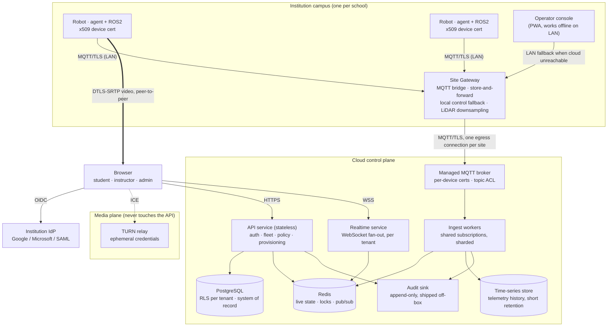
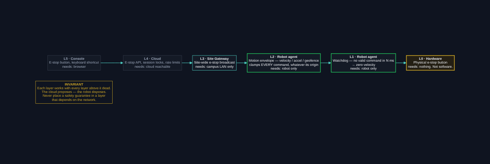

# Target Architecture — Designing for Many Institutions

**Companion to** [`docs/architecture-assessment.md`](architecture-assessment.md). The assessment says what is wrong today. This document says what to build instead, why each choice was made over its alternatives, and how to get there from the current system without a rewrite and without downtime.

**Audience:** whoever implements this — including future-you, and the students and staff who will inherit it.

**How to read it:** §1–§3 are the principles and the picture. §4 is the substance — eleven decisions, each with the options that were considered and the reason one won. §5–§9 detail the components. §10 is the migration path, which matters as much as the destination. §11 says what we are deliberately *not* building.

---

## 1. What this system is being designed for

A robotics teleoperation platform serving schools, colleges, and universities — where the operators are students and instructors, the robots are physically near children, the network is campus Wi-Fi of unknown quality, and the buyer has a small budget and no dedicated IT staff.

That sentence contains every hard constraint. It is worth being explicit about the sizing target, so the design can be judged rather than admired:

| Phase | Institutions | Robots | Peak concurrent users | Design stance |
|---|---|---|---|---|
| **A — Pilot** | 5–10 | ~50 | ~200 | Must work flawlessly. Manual ops acceptable. |
| **B — Scale** | ~100 | ~500 | ~2,000 | **Design explicitly for this.** |
| **C — Platform** | ~500 | ~2,500 | ~5,000 | Must not be *precluded*. Do not build for it yet. |

Designing for B while leaving the door open to C is the correct amount of ambition. Building for C now would produce a distributed system that a small team cannot operate and no school can afford.

---

## 2. Design principles

These are the non-negotiables. Every decision in §4 traces back to one of them, and when a future trade-off is unclear, these break the tie.

**P1 — Safety degrades downward, never upward.** Every safety function must work when everything above it has failed. A robot must stop safely with the cloud unreachable, the gateway powered off, and the browser closed. Never place a safety guarantee in a layer that depends on the network.

**P2 — Isolation is enforced by the datastore, not by developer discipline.** A forgotten `WHERE tenant_id = …` must return zero rows, not another school's robots. Tenant isolation that depends on every future contributor remembering something will eventually fail, and the failure will be a headline.

**P3 — The campus link is assumed hostile.** Slow, filtered, NATed, and periodically absent. A lesson must not be cancelled because the internet is down.

**P4 — Institutions bring their own identity.** Every school already has Google Workspace or Microsoft accounts. Building a competing user database creates onboarding friction, password-reset burden, and a credential store worth stealing.

**P5 — Minimise what is collected, and never record video.** The cheapest way to protect children's data is not to hold it. This is a design constraint, not a default setting.

**P6 — Evolutionary, not revolutionary.** The existing container boundary, MQTT contract, and agent design are correct. Everything here extends them. Any proposal requiring a rewrite has been rejected on principle.

**P7 — Boring technology, aggressively.** A two-person team supporting 100 schools cannot also operate a self-managed message broker cluster. Prefer managed services and well-worn tools over interesting ones.

---

## 3. The target architecture



*Static image version: [`docs/images/target-architecture.png`](images/target-architecture.png).*

Four planes, deliberately separated because they scale on different axes and fail independently:

| Plane | Bound by | Scales with | Failure impact |
|---|---|---|---|
| **Control** (API) | Requests/sec | Users | No new sessions; existing teleop continues |
| **Ingest** (MQTT consumers) | Messages/sec | Robots | Stale dashboards; robots still driveable |
| **Realtime** (WebSocket) | Open connections | Concurrent viewers | Dashboards freeze; teleop unaffected |
| **Media** (WebRTC/TURN) | Bandwidth | Concurrent video streams | No video; teleop and telemetry unaffected |

Today all four are one process, so the weakest one caps all of them and any failure takes down everything.

---

## 4. Design decisions

Written in the form this project's own docs already use: the choice, the alternatives, and why the obvious simpler option lost.

### D1 — Tenancy: pooled, with isolation enforced in the datastore

**Options.** *Silo* (a full stack per institution) gives perfect isolation but multiplies operating cost and patching effort by the number of customers — unaffordable at 100 schools with a small team. *Pooled with application-level filtering* is cheap but makes every future `SELECT` a potential cross-tenant leak. *Pooled with datastore-enforced isolation* keeps the economics and removes the human failure mode.

**Decision.** Pooled, with `tenant_id` on every tenant-owned table and **PostgreSQL row-level security** so a query that forgets its filter returns nothing rather than everything (P2). One caveat that must be respected: RLS is bypassed by table owners and superusers, so the application must connect as a dedicated non-owner role.

Isolation is layered, and each layer fails closed independently:

| Layer | Mechanism | Behaviour on developer error |
|---|---|---|
| Token | `tenant_id` claim, signed; never read from a request parameter | Cannot be forged |
| API | Scope derived from the token only | N/A — no parameter to forget |
| Postgres | RLS policy per tenant table, session variable set per request | Missing `WHERE` returns zero rows |
| Redis | Key prefix `t:{tenant_id}:…` | Key collision impossible across tenants |
| MQTT | `tenants/{tenant_id}/…` topics + per-certificate ACL | Broker rejects publish/subscribe |

**Escape hatch preserved.** A large university demanding a dedicated deployment gets the same container images with a different Terraform workspace. No code path diverges.

### D2 — Human identity: federate to the institution, don't own it

**Options.** *Own user database* means building password reset, MFA, and lockout — and holding credentials for thousands of minors. *Pure federation* removes that burden but breaks where a school has no IdP.

**Decision.** **OIDC federation as the primary path** (Google Workspace for Education and Microsoft Entra ID cover the overwhelming majority of institutions), with a local-account fallback for institutions without an IdP (P4). The school's existing offboarding process then automatically revokes access — which is a stronger guarantee than anything we would build.

**Important product nuance:** younger students often have no institutional account at all. Requiring SSO for a Year-7 class would block adoption. So there is a third path — **session join codes**: an instructor opens a lesson, students join with a short code, and their identity is scoped to that session and expires with it. Least data collected, no accounts for minors, and it maps to how a classroom actually works (P5).

### D3 — Device identity: one x509 certificate per robot

**Options.** The current *shared password* means any extracted credential impersonates the whole fleet. *Per-device passwords* fix impersonation but need secure distribution and rotation. *Per-device x509* is the industry-standard answer and what every managed IoT broker expects natively.

**Decision.** Per-device x509 client certificates, issued during a provisioning workflow, with the certificate CN carrying both `tenant_id` and `robot_id` and the broker's ACL deriving topic scope from the certificate rather than a claimed username. Physical robots in schools are student-accessible, so assume device compromise and make its blast radius exactly one robot.

**Rotation, decided now rather than discovered later:** certificates are short-lived (90 days) and auto-renewed by the agent while healthy; the gateway can re-issue for robots on its site. Revocation is a broker-side deny list, effective immediately.

### D4 — A site gateway at each institution

This is the largest addition to the current design, and the one most specific to the education setting.

**Problem.** Campus networks are NATed and firewalled; school IT will not open inbound ports or approve fifty outbound device connections; Wi-Fi drops mid-lesson; and raw LiDAR from every robot to the cloud is the bandwidth problem identified in the assessment.

**Options.** *Robots connect directly to the cloud* (today's model) is simplest but inherits every problem above. *Full edge autonomy* (each site runs the entire stack) solves connectivity but creates N deployments to operate — the silo problem again. *A thin per-site gateway* splits the difference.

**Decision.** A **Site Gateway** per institution — a small always-on machine (a Raspberry Pi 5 class device or a lab PC) that:

- **bridges** robot MQTT traffic over one authenticated outbound connection, so school IT approves a single egress rule
- **aggregates and downsamples** telemetry, sending LiDAR at a rate a browser canvas can actually use rather than the robot's native rate — this alone removes the projected 75 MB/s bandwidth problem
- **buffers** telemetry and audit events during cloud outages and replays them on reconnect
- **serves local control** when the cloud is unreachable: the console is a PWA, so it loads from cache and talks to the gateway over the LAN, and the lesson continues (P3)
- **holds no durable authority** — it caches policy and roster, and enforces them, but the cloud remains the system of record

**Honest trade-off:** this is a new component to build, ship, and update remotely, and OTA update of edge devices is its own discipline. It is worth it because it converts three separate hard problems (firewalls, bandwidth, outages) into one component. It is also **optional** — a robot with good connectivity may connect directly, and the gateway must never become a hard dependency for a single-robot deployment.

### D5 — Split the monolith along its scaling axes

**Decision.** Four deployables — API, ingest workers, realtime service, and the existing robot agent — rather than one backend. Justified by the table in §3: coupling a connection-bound service to a throughput-bound one means scaling both for whichever saturates first.

This is a *modest* split. Not microservices — four services, one shared library, one repository, one deployment pipeline (P7).

### D6 — Event-driven fan-out, not polling

**Options.** *Keep polling* is simplest and is what exists. *Event-driven push* costs a pub/sub layer. The assessment's arithmetic settles it: polling costs roughly 25 million Redis operations per second at Phase C and around 50,000/sec even with correct tenant scoping — for data that mostly has not changed.

**Decision.** Ingest workers publish changes to a Redis pub/sub channel per tenant; the realtime service subscribes once per tenant and fans out to all connected viewers of that tenant. Cost becomes proportional to *change rate × tenants*, not *viewers × robots × poll rate*. A single snapshot serves every viewer watching the same fleet.

Per-robot live state also collapses into **one Redis hash** (`HGETALL`) instead of four round-trips, and the current status/telemetry/health/lidar keys merge accordingly.

### D7 — Telemetry history as a first-class, short-retention store

**Problem not yet in the system.** Only "latest value" is kept. But instructors will ask *"what did the robot do during the lesson?"* — for grading, for debugging, and for incident review. There is currently no answer.

**Decision.** A time-series store (TimescaleDB as a Postgres extension keeps the operational surface at one database — P7) holding downsampled telemetry with **30-day default retention**, tenant-scoped, configurable down but capped up. Raw LiDAR is **not** retained; it is live-only.

Retention is deliberately short: it bounds storage cost, and it bounds the harm if the store is ever breached (P5).

### D8 — Authorization: four roles, plus session-scoped grants

| Role | May do |
|---|---|
| **Student** | See robots assigned to their active session; drive them; trigger e-stop on those robots |
| **Instructor** | All student rights within their institution; assign robots; override any session; e-stop *any* robot in the tenant; view class history |
| **Institution admin** | Manage users, robots, gateways, and policy within the tenant |
| **Platform operator** | Cross-tenant, break-glass only, time-boxed and loudly audited |

**Two decisions inside this that matter:**

**E-stop scope.** Today `stop` is a fleet-wide override for any authenticated user — correct in a lab, a cross-tenant DoS in production. It becomes: any authenticated user may e-stop **any robot within their own tenant**, always, with no session-ownership requirement. Deliberately broad within the boundary — a student who sees a robot heading for a child must not be blocked by "you don't hold the lock" — and impossible across the boundary.

**Break-glass.** Platform-operator access to tenant data requires an explicit, reason-tagged, time-limited elevation that writes to the audit log before it grants anything. Support access that leaves no trace is indistinguishable from a breach.

### D9 — Safety as an independent, layered system

Robots operate near children. Safety gets designed as its own architecture, not as a feature of the API.

| Layer | Mechanism | Depends on |
|---|---|---|
| **L0** | Physical e-stop button on the robot | Nothing. Not software. |
| **L1** | Agent watchdog — no valid command within *N* ms → zero velocity | Robot only |
| **L2** | Agent motion envelope — velocity, acceleration, and optional geofence clamps applied to *every* command regardless of origin | Robot only |
| **L3** | Gateway e-stop broadcast to all robots on site | Site LAN |
| **L4** | Cloud e-stop, session locks, rate limits | Cloud |
| **L5** | Console e-stop button, keyboard shortcut | Browser |



**The invariant: each layer functions with every layer above it dead** (P1). L1 and L2 already exist in the agent and are the reason this is a strengthening rather than a rebuild.

**The critical rule this encodes:** the motion envelope is enforced *robot-side*. The cloud proposes; the robot disposes. A compromised backend, a malicious client, or a bug in rate limiting can never command a velocity the robot's own envelope forbids. Never trust the network for safety.

### D10 — Audit: hash-chained locally, shipped off-box

The existing tamper-evident chain is a genuine asset and is kept. Two additions:

- **Ship it off-box** to append-only storage (object storage with retention lock). A chain that proves tampering only helps if an attacker with a live database connection cannot rewrite it and re-chain from that point forward.
- **Pseudonymous actors.** The chain stores a stable user *identifier*, never a name or email; the mapping lives in a separate, erasable table. This resolves the direct conflict between an immutable audit chain and a data-erasure request (P5) — erase the mapping, and the chain stays intact but no longer identifies a person.

### D11 — Transport: TLS everywhere, ephemeral credentials

MQTT moves to 8883 with mutual TLS (D3). The TURN static credential — currently readable by anyone who opens DevTools, usable to relay arbitrary traffic at your cost — is replaced with the standard time-limited HMAC scheme, issued by the API per session and valid for minutes.

---

## 5. Data model

The shape that matters. Every tenant-owned table carries `tenant_id` and an RLS policy.

```sql
CREATE TABLE tenants (
    tenant_id     UUID PRIMARY KEY,
    slug          TEXT UNIQUE NOT NULL,           -- 'st-xaviers-mumbai'
    display_name  TEXT NOT NULL,
    idp_issuer    TEXT,                           -- NULL = local accounts only
    policy        JSONB NOT NULL DEFAULT '{}',    -- velocity caps, retention, feature flags
    created_at    TIMESTAMPTZ NOT NULL DEFAULT now()
);

CREATE TABLE users (
    user_id       UUID PRIMARY KEY,
    tenant_id     UUID NOT NULL REFERENCES tenants,
    subject       TEXT,                           -- IdP 'sub'; NULL for local/session users
    email         TEXT,                           -- erasable; audit log references user_id only
    role          TEXT NOT NULL CHECK (role IN ('student','instructor','admin','platform')),
    UNIQUE (tenant_id, subject)
);

CREATE TABLE robots (
    robot_id      TEXT NOT NULL,
    tenant_id     UUID NOT NULL REFERENCES tenants,
    site_id       UUID REFERENCES sites,
    display_name  TEXT NOT NULL,
    cert_serial   TEXT UNIQUE,                    -- binds identity to hardware (D3)
    status        TEXT NOT NULL DEFAULT 'pending_approval',
    PRIMARY KEY (tenant_id, robot_id)             -- robot_id unique per tenant, not globally
);

ALTER TABLE robots ENABLE ROW LEVEL SECURITY;
CREATE POLICY robots_tenant_isolation ON robots
    USING (tenant_id = current_setting('app.tenant_id')::uuid);
```

Three details carrying real weight:

- **`PRIMARY KEY (tenant_id, robot_id)`** — two schools may both name a robot `turtlebot3_01` without collision. A global `robot_id` namespace would force customers to invent unique names, which they will not do.
- **`status = 'pending_approval'`** — replaces today's first-seen auto-registration. A robot presenting a valid certificate becomes *visible* to its tenant admin, not *active* in the fleet. Provisioning is an approval, not a side effect of connecting.
- **`policy JSONB`** — per-tenant velocity caps and retention live here, cached by the gateway and enforced by the agent (D9).

MQTT topics gain one level and mirror the same hierarchy:

```
tenants/{tenant_id}/robots/{robot_id}/{cmd|telemetry|health|status|heartbeat|lidar|camera/*}
```

---

## 6. Request path, end to end

A student presses an arrow key:

1. Browser sends the command over an authenticated WebSocket to the **realtime service**.
2. Service validates the session token, reads `tenant_id` from the signed claim, and checks the Redis session lock.
3. Rate limit checked (backstop above the client throttle; e-stop exempt).
4. Command published to `tenants/{tenant}/robots/{robot}/cmd`.
5. Broker ACL confirms the publisher's certificate is entitled to that topic.
6. **Site gateway** receives it and forwards over the LAN.
7. **Agent** applies the motion envelope (D9 L2) — clamping or rejecting anything outside tenant policy — then publishes `/cmd_vel`.
8. Audit entry written asynchronously; failure alerts but never blocks the command.

When the cloud link is down, steps 1–5 are replaced by the console talking directly to the gateway over the LAN. Steps 6–8 are unchanged, and the audit entries buffer for replay. **The safety-relevant step (7) is identical in both paths** — which is the whole point of P1.

---

## 7. Deployment and operations

**Infrastructure as code from day one.** Terraform, one module, three workspaces (dev/staging/prod). Manual console changes are how environments drift apart and how the pilot stops resembling production.

**Progressive delivery by tenant.** New versions roll to an internal tenant, then pilot tenants, then everyone. Feature flags are tenant-scoped. A regression should reach one school, not five hundred.

**Observability with `tenant_id` as a first-class dimension** on every metric, log line, and trace. "Is it slow?" is unanswerable at 100 institutions; "is it slow *for Kendriya Vidyalaya*?" is the question actually asked.

**SLOs, so operational trade-offs stop being arguments about opinions:**

| Service | Objective |
|---|---|
| Teleop command → robot motion | p99 < 250 ms, within a session |
| API availability | 99.5% monthly |
| Dashboard staleness | < 3 s under normal load |
| Robot e-stop (L4 cloud path) | p99 < 150 ms |
| Local operation during cloud outage | Available within 10 s of link loss |

**Migrations** via Alembic, using expand/contract so schema changes never require synchronised deploys. **Backups** with a documented and *rehearsed* restore — an untested restore is not a backup.

---

## 8. Security architecture summary

| Concern | Design |
|---|---|
| Human identity | OIDC federation; local fallback; session join codes for minors (D2) |
| Device identity | Per-device x509, 90-day auto-renewal, broker-side revocation (D3) |
| Transport | TLS everywhere; mutual TLS for devices; ephemeral TURN credentials (D11) |
| Tenant isolation | Token claim → RLS → key prefix → topic ACL, each failing closed (D1) |
| Authorization | Four roles; tenant-scoped e-stop; audited break-glass (D8) |
| Session tokens | Short-lived, revocable, `httpOnly`+`Secure`+`SameSite` cookie with CSRF token — moving off `localStorage` |
| Secrets | Managed secret store, rotated; no credential in an image or `.env` in production |
| Audit | Hash-chained, pseudonymous, shipped to append-only storage (D10) |
| Supply chain | Pinned dependencies, SBOM per release, image scanning in CI, signed images |
| Video | Peer-to-peer, never recorded — an architectural constraint, not a setting (P5) |

---

## 9. Privacy and compliance by design

Schools mean minors, which means DPDP Act 2023 (India), GDPR where applicable, and FERPA in US institutions.

- **Data minimisation is structural.** No video recording; LiDAR is live-only; telemetry retention defaults to 30 days; audit stores pseudonymous identifiers.
- **Session join codes** mean the youngest students need no persistent account and no personal data at all (D2).
- **Erasure** is implementable because identity is separable from the immutable audit chain (D10).
- **Data residency** is a Terraform variable, so an institution requiring in-country storage is a deployment decision rather than a redesign.
- **A Data Protection Impact Assessment before the first pilot**, not the fiftieth. It is cheap now and expensive as a remediation.

---

## 10. Migration path

Sequenced so that nothing breaks and each step is independently shippable and reversible. Existing tests must pass at every step.

### Stage 1 — Tenancy foundation *(highest cost of delay; do first)*
1. Add `tenant_id` as **nullable** to all tenant-owned tables.
2. Backfill every existing row to a single `default` tenant.
3. Set `NOT NULL`; enable RLS; switch the app to a non-owner DB role.
4. Add the `tenant_id` claim to tokens; derive every query's scope from it.
5. Publish to the new `tenants/{tenant}/…` topics **while still subscribing to both**; migrate robots; then drop the old topics.

Expand/contract throughout: the schema tolerates both old and new code simultaneously, so no synchronised deploy is required and rollback stays available.

### Stage 2 — Identity and device trust
6. `users` table, roles, RBAC middleware — with the existing shared credential still working behind a flag.
7. OIDC federation; then session join codes; then remove the shared credential.
8. Per-device certificates: provisioning workflow, dual-auth period (password *or* cert), then password auth disabled.

### Stage 3 — Safety and scale
9. Motion envelope enforcement in the agent (D9 L2) — deployable independently and valuable immediately.
10. Split the deployables (D5); move WebRTC correlation into Redis; unique MQTT client IDs and shared subscriptions.
11. Event-driven fan-out (D6); collapse per-robot state into one hash.

### Stage 4 — Edge and history
12. Site Gateway: bridge and downsampling first; then store-and-forward; then local control fallback.
13. Time-series store and retention policy (D7).

### Stage 5 — Operational maturity
14. Terraform, CI/CD with security gates, observability, SLO alerting, HA for every current singleton, rehearsed restore.

**Ordering rationale:** Stage 1 first because its cost curve is the steepest — every institution onboarded before it lands multiplies the eventual migration. Stage 3's item 9 is deliberately early despite being "scale" work, because it is a safety improvement that does not depend on anything else.

---

## 11. What we are deliberately not building

Saying no explicitly is what keeps a small team's design coherent.

| Not building | Why |
|---|---|
| A custom identity provider | Schools have one. Owning minors' credentials is a liability, not a feature (D2). |
| Session/video recording | The single largest regulatory step available. Not without a DPIA and explicit consent — and probably not then (P5). |
| A self-managed broker cluster | Operationally expensive for a small team. Use managed (P7). |
| Multi-region active-active | Solves a problem 500 institutions in one country do not have. Data residency is handled by deployment, not replication. |
| Native mobile apps | The PWA already covers offline and installability. |
| Autonomous navigation / fleet task orchestration | A different product. Teleoperation and teaching first. |
| A plugin/extension marketplace | Interesting at 500 institutions. A distraction at 10. |

---

## 12. Open questions

These need a decision from you; each meaningfully changes the design.

1. **Is offline classroom operation a requirement or a nice-to-have?** If required, the Site Gateway (D4) moves into Stage 1. If not, it can be deferred to Stage 4 as written. This is the single biggest scoping question here.
2. **Who owns the robot hardware** — the institution or you? This determines whether device provisioning is a self-service admin flow or a factory step, and who is liable for a physical safety incident.
3. **What is the youngest student age?** Below roughly 13, verifiable parental consent obligations change the identity design materially (D2).
4. **Is one robot shared by a class, or one per student group?** Session locking, queueing, and the entire classroom UX differ — a lock is right for the former, a scheduler for the latter.
5. **Cloud provider and region.** The migration guide assumes AWS; the design is portable, but Terraform modules are not.

---

## 13. Summary

The current system's foundations — the container boundary, the MQTT contract, the agent's safety watchdog, the composition point in `FleetManager`, and the documentation culture — are correct and are preserved intact. This design adds the layer the system was never built to have:

- **Tenancy** enforced by the datastore, so isolation does not depend on remembering (D1)
- **Federated identity** for humans, **certificates** for devices, **roles** for authorization (D2, D3, D8)
- **A site gateway** turning three hard campus problems into one component (D4)
- **Planes split** along their real scaling axes, with **event-driven** fan-out (D5, D6)
- **Layered safety** that works with the network dead, enforced robot-side (D9)
- **Privacy by structure** — nothing recorded, short retention, erasable identity (P5, D10)

Build Stage 1 before the second institution shares a deployment. Everything after that can be sequenced against real demand.
